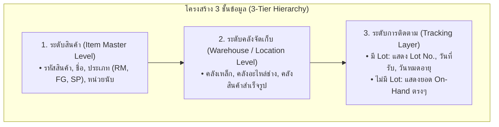
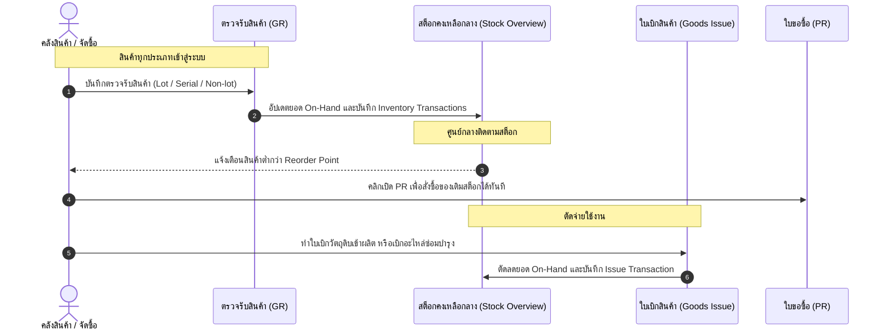

# พิมพ์เขียวระบบคลังสินค้าและสต็อกคงเหลือกลาง (Central Stock Overview) สู่มาตรฐาน ERP สากล 100%
**Comprehensive Architecture & Implementation Blueprint for Central Inventory Stock Management**
*เอกสารมาตรฐานการออกแบบและการพัฒนาหน้าสต็อกคงเหลือกลางเพื่อรองรับสินค้าทุกประเภทในองค์กรอย่างถูกต้องและยั่งยืน*

---

## 1. บทนำและวัตถุประสงค์ (Executive Summary)

### 1.1 ที่มาและปัญหาของระบบสต็อกเดิม
ในระบบ KRC-ERP เดิม หน้ารายงานสต็อกสินค้า (`/inventory/stock`) ได้รับการออกแบบแยกตามประเภทสินค้าเดิม ได้แก่:
1. **แท็บวัตถุดิบ (Raw Materials - RM):** ออกแบบให้อ่านข้อมูลจากตาราง `inventory_lots` ซึ่งผูกกับเหล็กแผ่นและสินค้าคุม Lot เป็นหลัก
2. **แท็บสินค้าสำเร็จรูป (Finished Goods - FG):** อ่านยอด On-Hand จากตารางสินค้าสำเร็จรูป

**ข้อจำกัดและปัญหาที่พบ:**
* **ขาดการรวมศูนย์ (Fragmented Views):** ผู้ใช้งานและฝ่ายจัดซื้อต้องคอยสลับแท็บเพื่อดูสต็อกของแต่ละกลุ่มสินค้า
* **สินค้ามีสต็อกที่ไม่คุม Lot มองไม่เห็นในระบบ:** เมื่อมีการตรวจรับสินค้า (GR) ประเภท **อะไหล่เครื่องจักร (Spare Parts - SP)**, **วัสดุสิ้นเปลือง (Consumables)**, หรือ **สินค้าทั่วไป (General Stocked Items)** เข้ามา ยอดในฐานข้อมูลเพิ่มขึ้นถูกต้อง แต่ **ไม่มีพื้นที่แสดงผลบนหน้าจอสต็อก** เนื่องจากไม่มีแท็บรองรับ
* **ไม่สอดคล้องกับมาตรฐาน ERP สากล:** ตามมาตรฐานสากล หน้าสต็อกต้องเป็น **"ศูนย์รวมข้อมูลสต็อกหน้าเดียว (Single Source of Truth)"** ที่แสดงสินค้าหมุนเวียนทุกชนิดพร้อมกัน

### 1.2 วัตถุประสงค์ของพิมพ์เขียวฉบับนี้
1. กำหนดสถาปัตยกรรมและโครงสร้างหน้าจอ **"สต็อกสินค้าคงเหลือกลาง (Central Stock On-Hand)"** ให้รองรับสินค้าทุกประเภทที่ตั้งค่า `is_stocked = true` ใน Item Master
2. รองรับทั้งสินค้าที่ **ควบคุมด้วย Lot (Lot-Controlled)** และ **ไม่ควบคุม Lot (Standard Stocked)** ให้อยู่ในตารางเดียวกันอย่างกลมกลืนและไม่ซับซ้อน
3. กำหนดมาตรฐานการคำนวณยอด **คงเหลือจริง (On-Hand)**, **ติดจอง (Reserved)**, และ **พร้อมใช้ (Available)**
4. จัดทำข้อกำหนดการออกแบบ UI/UX ให้ตรงตาม Design Tokens และ Components มาตรฐานของ KRC-ERP 100%

---

## 2. หลักการบริหารสต็อกตามมาตรฐาน ERP สากล (Global ERP Standards & Principles)

จากการศึกษาระบบ ERP ชั้นนำระดับสากล (เช่น **SAP S/4HANA (MMBE Stock Overview)**, **Oracle NetSuite**, **Microsoft Dynamics 365**, และ **Odoo**) พบว่าการออกแบบระบบสต็อกที่มีประสิทธิภาพสูงสุดต้องยึดหลัก 4 ประการ:



### 2.1 สมการสถานะสต็อกมาตรฐานสากล (Stock Balance Equation)
การแสดงยอดสต็อกต้องแสดง 3 ค่าหลักเสมอเพื่อความแม่นยำในการวางแผน:
$$\text{Available (พร้อมใช้)} = \text{On-Hand (คงเหลือจริง)} - \text{Reserved (ติดจอง)}$$

* **On-Hand (คงเหลือจริง):** จำนวนสินค้าที่มีตัวตนอยู่ในคลังจริง (นับได้เท่าไหร่คือยอดนี้)
* **Reserved (ติดจอง):** จำนวนสินค้าที่ถูกล็อกไว้สำหรับคำสั่งผลิต (Job/Work Order) หรือคำสั่งขาย (Sales Order) ที่รอตัดจ่าย
* **Available (พร้อมใช้):** จำนวนสุทธิที่ฝ่ายจัดซื้อและฝ่ายผลิตสามารถนำไปใช้เปิดใบเบิกหรือวางแผนต่อได้ทันที

### 2.2 การแยกบทบาทระหว่าง "สต็อกหมุนเวียน" กับ "ทะเบียนสินทรัพย์"
* **หน้าสต็อกสินค้า (Inventory Stock):** จัดการ **"ยอดจำนวนคงเหลือ (Quantity Balances)"** ของสินค้าหมุนเวียน (RM, FG, SP, Consumables) เพื่อใช้ในการเบิกผลิต เติมสต็อก และตรวจนับ
* **หน้าทะเบียนสินทรัพย์ (Fixed Assets):** จัดการ **"ประวัติและสถานะรายชิ้น (Asset Lifecycle & Custodian)"** ของเครื่องจักร แม่พิมพ์ และอุปกรณ์ IT ซึ่งแยกหน้าไว้ที่ `/assets`

---

## 3. ตารางจำแนกพฤติกรรมสินค้าในระบบสต็อกกลาง (Inventory Item Behavior Matrix)

ระบบสต็อกกลางจะต้องแสดงผลสินค้าตามตารางพฤติกรรมนี้:

| กลุ่มสินค้า | ตัวอย่างในโรงงาน | ประเภท (`type_code`) | นโยบายสต็อก (`is_stocked`) | การคุม Lot (`tracking_method`) | พฤติกรรมการแสดงผลในหน้าสต็อกกลาง |
| :--- | :--- | :---: | :---: | :---: | :--- |
| **1. วัตถุดิบ/เคมีภัณฑ์** | แผ่นเหล็ก SPCC, สเตนเลส SUS304, สีอุตสาหกรรม | `RM` | `true` | `'lot'` | • แสดงยอดรวมของสินค้า<br>• **มีปุ่มลูกศร $\vee$ ให้กดคลี่ดูแต่ละ Lot** (เลข Lot, Lot ผู้ผลิต, วันหมดอายุ) |
| **2. อะไหล่เครื่องจักร** | สกรู, น็อต, ดอกสว่าน, สายพาน, ตลับลูกปืน | `SP` | `true` | `'none'` | • แสดงยอด On-Hand รวมในคลังโดยตรง<br>• **ไม่ต้องแตกตาราง Lot ให้รกตา** |
| **3. วัสดุสิ้นเปลือง** | หินเจียร, เทปกาว, กล่องกระดาษ, ถุงมือ | `CONS` | `true` | `'none'` | • แสดงยอด On-Hand รวมในคลังโดยตรง |
| **4. สินค้าสำเร็จรูป** | ตู้คอนโทรลสำเร็จรูป, ชิ้นส่วนปั๊มขึ้นรูป | `FG` | `true` | `'none'` หรือ `'lot'` | • แสดงรหัส Part Number, คลัง FG, และยอดพร้อมใช้ |
| **5. งานบริการ/ค่าใช้จ่าย** | ค่าจ้างตัดเลเซอร์, ค่าชุบผิว, ค่าเครื่องเขียน | `SR`, `EXP` | `false` | `'none'` | • **ไม่แสดงในหน้าสต็อกกลาง** (เนื่องจากไม่มีการเก็บสต็อกจริง) |

---

## 4. โครงสร้างฐานข้อมูลและการดึงข้อมูล (Database & RPC Architecture)

### 4.1 ตารางฐานข้อมูลหลักที่เกี่ยวข้อง
1. **ตาราง `item_master`:** ตารางสินค้ากลาง เก็บ `item_code`, `item_name`, `item_type_id`, `unit_id`, `reorder_point`, `tracking_method`
2. **ตาราง `item_types`:** ตารางประเภทสินค้า เก็บ `type_code`, `type_name`, `is_stocked`, `lot_controlled`, `serial_controlled`
3. **ตาราง `item_inventory_balances`:** เก็บยอด On-Hand, Reserved, Available รายสินค้าและรายคลัง
4. **ตาราง `inventory_lots`:** เก็บยอด On-Hand, Reserved ราย Lot สำหรับสินค้าที่ `tracking_method = 'lot'`
5. **ตาราง `inventory_transactions`:** เก็บบันทึกประวัติการเคลื่อนไหวสต็อกทุกรายการ (Receipt, Issue, Transfer, Adjust)

### 4.2 ข้อกำหนดฟังก์ชัน RPC: `get_central_inventory_balances`
สร้าง RPC ฟังก์ชันกลางเพื่อดึงข้อมูลสต็อกแบบ Single Query ที่มีประสิทธิภาพสูง:

```sql
create or replace function public.get_central_inventory_balances(
  p_type_code text default null,
  p_warehouse_id bigint default null,
  p_search text default null,
  p_status_filter text default null, -- 'all', 'low_stock', 'available'
  p_limit integer default 100,
  p_offset integer default 0
)
returns table (
  item_id bigint,
  item_code text,
  item_name text,
  item_description text,
  type_code text,
  type_name text,
  unit_name text,
  unit_symbol text,
  warehouse_id bigint,
  warehouse_name text,
  on_hand_qty numeric,
  reserved_qty numeric,
  available_qty numeric,
  reorder_point numeric,
  tracking_method text,
  lot_count integer,
  has_low_stock boolean,
  updated_at timestamptz
)
language plpgsql
security definer
set search_path = ''
as $$
begin
  -- Query aggregated stock balances with item_types join where is_stocked = true
  ...
end;
$$;
```

---

## 5. การออกแบบหน้าจอผู้ใช้งาน (UI/UX Specification)

การออกแบบหน้าจอต้องใช้ **Design Tokens, Components, และสไตล์มาตรฐานของ KRC-ERP** เพื่อให้กลมกลืนกับหน้าจออื่นๆ ในระบบ 100%:

```
+------------------------------------------------------------------------------------------------------------------------------------+
|  สต็อกสินค้าคงเหลือกลาง (Central Stock)                                                                        [ ส่งออก Excel ]     |
|  ตรวจสอบยอดคงเหลือจริง ยอดจอง และยอดพร้อมใช้ของสินค้าทุกประเภท                                                                      |
+------------------------------------------------------------------------------------------------------------------------------------+
| [ สินค้าทั้งหมด: 1,248 ] | [ พร้อมใช้: 1,180 ] | [ ติดจอง: 68 ] | [ ใกล้จุดสั่งซื้อ: 12 ] | [ สินค้าค้างนาน: 3 ]                       |
+------------------------------------------------------------------------------------------------------------------------------------+
| [Q ค้นหารหัส, ชื่อ หรือ Lot...           ] [ ประเภทสินค้า: ทั้งหมด  v ] [ คลังสินค้า: ทั้งหมด  v ] [ สถานะ: ทั้งหมด  v ]              |
+------------------------------------------------------------------------------------------------------------------------------------+
|  #  | รหัสสินค้า    | ชื่อสินค้า / รายละเอียด         | ประเภท | คลัง        | คงเหลือ  | ติดจอง | พร้อมใช้ | หน่วย | สถานะ      | จัดการ    |
+-----+--------------+-------------------------------+-------+-------------+----------+--------+---------+-------+-----------+-----------+
| [v] | RM-SPCC-001  | แผ่นเหล็ก SPCC 1.2x1219x2438  | [RM]  | คลังเหล็ก   | 1,260.00 |  68.00 | 1,180.00 | แผ่น  | [พร้อมใช้] | [บัตรสต็อก] |
|     |  └ Lot #260901-01  Vendor: POSCO-01  Exp: -          คลังเหล็ก     |   760.00 |  68.00 |   692.00 | แผ่น  |           | [ประวัติ]  |
|     |  └ Lot #260815-02  Vendor: POSCO-02  Exp: -          คลังเหล็ก     |   500.00 |   0.00 |   500.00 | แผ่น  |           | [ประวัติ]  |
|     | SP-SCR-006   | สกรูหัวจม M6 x 20 มม. SUS304  | [SP]  | คลังช่าง    |   230.00 |   0.00 |   230.00 | ตัว   | [ใกล้หมด]  | [บัตรสต็อก] |
|     | FG-BOX-991   | ตู้คอนโทรลสเตนเลส IP65        | [FG]  | คลังสินค้าFG |    20.00 |   0.00 |    20.00 | ตู้   | [พร้อมใช้] | [บัตรสต็อก] |
+------------------------------------------------------------------------------------------------------------------------------------+
```

### 5.1 รายละเอียดองค์ประกอบบนหน้าจอ

#### 1. แถบสรุปสถานะ 5 กล่อง (5-Box Status Strip)
ถอดแบบจากหน้า `Asset Catalog` และ `Partner Settings`:
* **กล่อง 1 (สินค้าทั้งหมด):** ตัวเลขสี Primary (แสดงจำนวนรายการทั้งหมด)
* **กล่อง 2 (พร้อมใช้):** ตัวเลขสีเขียว Emerald (สินค้าที่มีสต็อกพร้อมใช้งาน)
* **กล่อง 3 (ติดจอง):** ตัวเลขสีน้ำเงิน Blue (สินค้าที่ถูกจองไว้ในงานผลิต)
* **กล่อง 4 (ใกล้จุดสั่งซื้อ):** ตัวเลขสีส้ม Amber (สินค้าที่ `available_qty <= reorder_point` คลิกเพื่อกรองเฉพาะกลุ่มนี้)
* **กล่อง 5 (สินค้าค้างนาน):** ตัวเลขสีแดง Red (สินค้าที่ไม่มีการเคลื่อนไหวเกิน 90 วัน)

#### 2. แถบตัวกรอง (Search & Filter Bar)
* **ช่อง Search:** ค้นหาได้ทั้ง *รหัสสินค้า, ชื่อสินค้า, เลข Lot, หรือรายละเอียด*
* **Dropdown ประเภทสินค้า:** ดึงรายการจากตาราง `item_types` (`RM`, `FG`, `SP`, `CONS`, ฯลฯ)
* **Dropdown คลังสินค้า:** ดึงรายการคลังทั้งหมดจาก `raw_material_warehouses`
* **Dropdown สถานะ:** `ทั้งหมด`, `พร้อมใช้`, `ใกล้จุดสั่งซื้อ`, `สินค้าค้างนาน`

#### 3. ตารางข้อมูลหลัก (Unified Data Table)
* **คอลัมน์มาตรฐาน (11 คอลัมน์):**
  1. `# / ย่อ-ขยาย`: แสดงปุ่มลูกศร $\vee$ เฉพาะสินค้าคุม Lot
  2. `รหัสสินค้า (Item Code)`: แสดงรหัสสินค้าตัวหนา
  3. `ชื่อสินค้า / รายละเอียด`: ชื่อภาษาไทย/อังกฤษ พร้อมสเปกย่อย
  4. `ประเภท (Type Badge)`: แสดง Badge สีเฉพาะ เช่น `[RM]`, `[SP]`, `[FG]`
  5. `คลังจัดเก็บ (Warehouse)`: ชื่อคลังหลัก
  6. `คงเหลือ (On-Hand)`: ยอดจำนวนจริง
  7. `ติดจอง (Reserved)`: ยอดจอง (สีน้ำเงินถ้า > 0)
  8. `พร้อมใช้ (Available)`: ยอดพร้อมใช้ตัวหนา (สีเขียว)
  9. `หน่วย (Unit)`: สัญลักษณ์หน่วยนับ
  10. `สถานะ (Status Badge)`: ป้ายสถานะ `[ปกติ]`, `[ใกล้หมด (Low Stock)]`
  11. `จัดการ (Actions)`: ปุ่มเปิด **"บัตรสต็อก (Stock Card)"**

#### 4. แถวย่อยของสินค้าคุม Lot (Expandable Sub-rows)
เมื่อกดคลิกคลี่แถวสินค้าคุม Lot:
* แสดงรายการย่อยของแต่ละ Lot ในพื้นหลังสีเทาอ่อน (`bg-surface-container-low/40`)
* แสดง: *เลข Lot ภายใน, Lot ผู้ผลิต (Vendor Lot), วันที่รับเข้า, วันหมดอายุ, ยอดเฉพาะล็อต, และปุ่มดูประวัติเฉพาะล็อต*

#### 5. หน้าต่างดูบัตรสต็อก (Stock Card History Drawer / Modal)
* เมื่อกดปุ่ม **"บัตรสต็อก"**: เปิดหน้าต่างแสดงประวัติการเคลื่อนไหวสต็อกย้อนหลัง (วันที่, ประเภทเอกสาร GR/Issue/Adjust, เลขที่เอกสาร, จำนวนเปลี่ยนแปลง $+/-$, ผู้ดำเนินการ)

---

## 6. การเชื่อมต่อกับวงจรระบบ ERP (Cross-Module Workflows)



---

## 7. แผนงานและลำดับการพัฒนา (Implementation Roadmap)

| ลำดับ | รายการพัฒนา | รายละเอียดงาน | ผลลัพธ์ |
| :---: | :--- | :--- | :--- |
| **Phase 1** | **Backend Server Actions & RPC** | • สร้าง RPC `get_central_inventory_balances`<br>• สร้าง Action `getUnifiedStockBalancesAction()` ใน `src/app/actions/inventory.ts` | Backend ส่งข้อมูลสต็อกสินค้าทุกประเภทได้ใน Call เดียว |
| **Phase 2** | **UI Stock Dashboard Refactoring** | • ปรับปรุงหน้า `stock-dashboard-page.tsx`<br>• เพิ่มแถบสรุปสถานะ 5 กล่อง<br>• ทำตาราง Unified Smart Table รองรับทั้ง Lot และ Non-lot | หน้าจอสต็อกแสดงสินค้าทุกประเภทได้แบบ Single View |
| **Phase 3** | **Stock Card Drawer Integration** | • ปรับปรุง Slide-over Drawer / Modal บัตรสต็อกให้รองรับสินค้าทุกประเภท | ดูประวัติเคลื่อนไหวได้ทั้งวัตถุดิบ, อะไหล่, และสินค้าสำเร็จรูป |
| **Phase 4** | **Export & Testing** | • ทดสอบความถูกต้องยอด On-Hand / Reserved / Available<br>• ทดสอบส่งออกรายงาน Excel สต็อกรวม | ระบบสต็อกพร้อมใช้งาน 100% ตามมาตรฐาน ERP สากล |

---

## 8. ประโยชน์ที่องค์กรจะได้รับ
1. **มองเห็นสต็อกครบ 100% ในหน้าเดียว:** จัดซื้อ คลัง และผู้บริหารไม่ต้องเปิดหลายหน้าเพื่อเช็กของ
2. **ป้องกันของขาดสต็อก (Zero Stockout):** มีแถบแจ้งเตือน Low Stock ชัดเจน ช่วยให้เปิด PR เติมของได้ก่อนสายการผลิตจะสะดุด
3. **รองรับการเติบโตในอนาคต (Future-Proof):** ไม่ว่าจะเพิ่มสินค้าประเภทใหม่กี่ร้อยรายการ ระบบจะจัดกลุ่มและแสดงผลบนหน้าสต็อกกลางนี้ได้ทันทีโดยไม่ต้องแก้โค้ดใหม่
