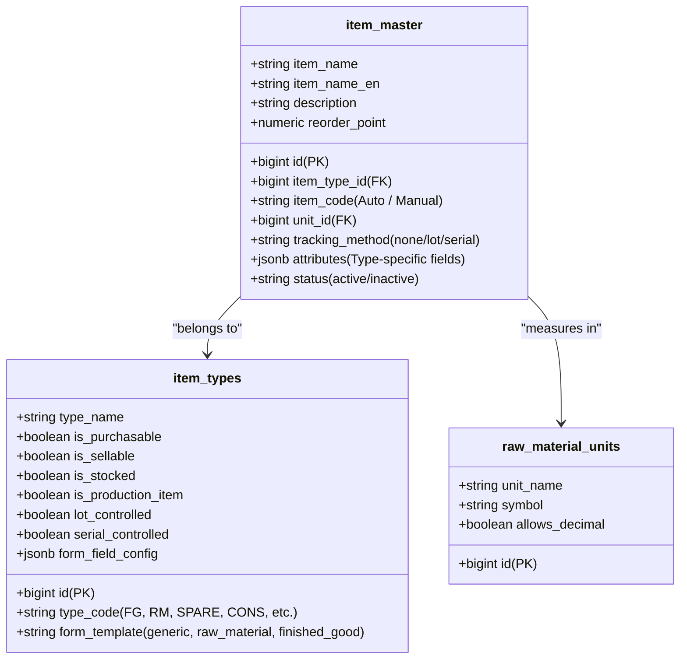
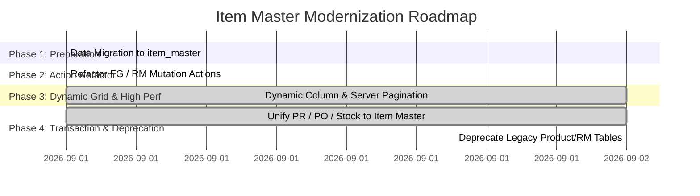

# สรุปสถาปัตยกรรมระบบสินค้าและรายการกลาง (Item Master Architecture & UI/UX Standards)
**โครงการ:** KRC ERP  
**วันที่บันทึก:** 1 กันยายน 2026  
**สถานะ:** เอกสารข้อเสนอแนะและมาตรฐานสถาปัตยกรรม (Architecture Proposal & Standard Guide)

---

## 📌 สารบัญ (Table of Contents)
1. [บทนำและภาพรวมปัญหา (Overview & Context)](#1-บทนำและภาพรวมปัญหา)
2. [หลักการสถาปัตยกรรมข้อมูลสากล (Global Data Architecture Standard)](#2-หลักการสถาปัตยกรรมข้อมูลสากล)
   - 2.1 เปรียบเทียบระหว่าง Single Master Table vs Separate Tables
   - 2.2 โครงสร้าง Entity และ Data Model ที่แนะนำ
3. [การออกแบบหน้าจอและตาราง (UI/UX Grid & Table Design)](#3-การออกแบบหน้าจอและตาราง-uiux-grid--table-design)
   - 3.1 All Items View vs Type-Specific Filtered Tabs
   - 3.2 ปัญหาเมื่อมีประเภทสินค้าใหม่และฟิลด์มากกว่า 10+ คอลัมน์
4. [ระบบ Metadata-Driven UI & Dynamic Columns](#4-ระบบ-metadata-driven-ui--dynamic-columns)
   - 4.1 กลไกการสร้างคอลัมน์อัตโนมัติ (Auto-Generate Columns)
   - 4.2 เกณฑ์การตัดสินความสำคัญของคอลัมน์ (Column Selection Criteria)
5. [เทคนิคการจัดการข้อมูล 10+ ฟิลด์ในตาราง](#5-เทคนิคการจัดการข้อมูล-10-ฟิลด์ในตาราง)
6. [แผนงานการปรับปรุงสู่มาตรฐานสากล (Implementation Roadmap)](#6-แผนงานการปรับปรุงสู่มาตรฐานสากล)

---

## 1. บทนำและภาพรวมปัญหา

ในระบบ ERP ปัจจุบัน มีข้อมูลสินค้ากระจายตัวอยู่ใน 3 ตารางหลัก:
1. `products`: เก็บสินค้าสำเร็จรูป (Finished Goods - FG) สำหรับงานขายและการผลิต
2. `raw_materials`: เก็บวัตถุดิบ (Raw Materials - RM) สำหรับงานจัดซื้อและสต็อกแผ่น/เพลา
3. `item_master`: ตารางข้อมูลสินค้าและรายการกลางใหม่ที่รองรับการจัดหมวดหมู่ผ่าน `item_types`

### สถานะปัจจุบันของระบบ:
* **ระดับหน้าจอและแอ็กชัน:** มีการทำ Unified Query ผ่าน `getItemCatalogAction()` ใน [src/app/actions/items.ts](file:///C:/Users/Riew/Desktop/Job_NBV/KRC/krc-erp/src/app/actions/items.ts) เพื่อรวมข้อมูลทั้ง 3 แหล่งมาแสดงผลในหน้า `/items` พร้อมระบบ Deduplication
* **ระดับฐานข้อมูล:** ยังเป็นสถาปัตยกรรมแบบ **Hybrid** โดยการบันทึกข้อมูลใหม่ (Create/Update) ยังแยกเขียนลงตารางของตนเอง

---

## 2. หลักการสถาปัตยกรรมข้อมูลสากล

### 2.1 เปรียบเทียบ: แยกตาราง vs รวมเป็น `item_master` ตารางเดียว

| ประเด็น | แบบเดิม (แยกตาราง `products` / `raw_materials`) | มาตรฐานสากล (รวมเป็น `item_master` ตารางเดียว) |
| :--- | :--- | :--- |
| **ความซ้ำซ้อนของข้อมูล** | สูง เสี่ยงต่อข้อมูลไม่ตรงกันระหว่างระบบ | **Single Source of Truth** ข้อมูลถูกต้องจุดเดียว |
| **Foreign Key (FK)** | ซับซ้อน (Polymorphic FK ต้องมี `source_type` + `source_id`) | **Clean FK** เอกสาร PR, PO, GR, Stock, BOM อ้างอิง `item_id` ตัวเดียว |
| **รายงานสต็อกและบัญชี** | ต้อง Union ตารางทุกครั้งที่ออกรายงาน Stock Ledger | ออกรายงานจากตารางสินค้าและ Ledger กลางได้ทันที รวดเร็วและแม่นยำ |
| **โครงสร้าง BOM การผลิต** | เชื่อมโยง Parent (FG) และ Child (RM) ข้ามตารางได้ยาก | เชื่อมโยงแบบ Parent-Child ภายใน `item_master` ได้อย่างราบรื่น |
| **การรองรับประเภทใหม่** | ต้องสร้างตารางใหม่และเขียนโค้ดใหม่ทุกครั้ง | เพิ่มประเภทสินค้าผ่านหน้าจอตั้งค่าได้ทันที ไม่ต้องแก้ฐานข้อมูล |

> [!TIP]
> **ระบบ ERP ระดับโลก (SAP S/4HANA, Microsoft Dynamics 365, Oracle NetSuite, Odoo)** 
> ล้วนใช้ตาราง Item/Material Master ตารางเดียว แล้วควบคุมพฤติกรรมผ่าน **Item Type / Material Type** และ **JSONB/Attributes Extension**

### 2.2 โครงสร้าง Entity Model ที่แนะนำ



---

## 3. การออกแบบหน้าจอและตาราง (UI/UX Grid Design)

### 3.1 สองมุมมองมาตรฐานสากล: All Items vs Type Tabs

```
┌─────────────────────────────────────────────────────────────────────────────┐
│ 1. All Items View (หน้ารวมสินค้าทั้งหมด)                                      │
│    ➔ แสดงเฉพาะ "Global Core Columns" ที่ทุกสินค้ามีร่วมกัน 100%                 │
│    [รหัสสินค้า] | [ชื่อสินค้า] | [ประเภท] | [หน่วยนับ] | [คลังหลัก] | [สถานะ]        │
└─────────────────────────────────────────────────────────────────────────────┘
                                  │
                                  ▼
┌─────────────────────────────────────────────────────────────────────────────┐
│ 2. Filtered Tab View (หน้าแยกแท็บตามประเภท FG, RM, Consumables, Spare Parts)  │
│    ➔ ใช้ "Adaptive Dynamic Columns" ปรับตามฟิลด์เด่นของประเภทนั้นๆ               │
│    - แท็บ FG:  [รหัส] | [Part No.] | [Part Name] | [Model] | [Material] | [สถานะ]│
│    - แท็บ RM:  [รหัส] | [ชื่อ RM] | [เกรด] | [หนา x กว้าง x ยาว] | [คลัง] | [สถานะ]│
│    - แท็บใหม่: [รหัส] | [ชื่อ] | [ฟิลด์สำคัญที่เปิดใช้] | [หน่วยนับ] | [สถานะ]   │
└─────────────────────────────────────────────────────────────────────────────┘
```

---

## 4. ระบบ Metadata-Driven UI & Dynamic Columns

### 4.1 กลไกการทำงานเมื่อ Admin เพิ่มประเภทสินค้าใหม่

1. **Admin ตั้งค่าที่หน้า `/settings/item-types`**:
   * กำหนดรหัสและชื่อประเภท (เช่น `SPARE` - อะไหล่เครื่องจักร)
   * ติ๊กเปิดฟิลด์ที่ต้องการใช้: ✅ ยี่ห้อ (Brand), ✅ รุ่น (Model), ✅ จุดสั่งซื้อ (Reorder Point)
2. **ระบบหน้าตาราง (`ItemCatalog`) ทำงานอัตโนมัติ**:
   * ดึง `form_field_config` ของประเภทนั้นมาอ่าน
   * คำนวณคอลัมน์เด่นและนำมาขึ้นตารางให้อัตโนมัติ **โดยที่ Developer ไม่ต้องเขียนโค้ดเพิ่ม**

### 4.2 เกณฑ์ 4 ลำดับในการคัดเลือกคอลัมน์ (Column Selection Criteria)

เมื่อประเภทสินค้ามีข้อมูลเยอะ ระบบจะวัดความสำคัญของคอลัมน์จาก:

```
[Rank 1: Core Identity (100%)]
  └── รหัสสินค้า (Code), ชื่อสินค้า (Name), หน่วยนับ (Unit), สถานะ (Status)

[Rank 2: Key Specifications (Required Fields)]
  └── Part Number, ยี่ห้อ (Brand), รุ่น (Model), เกรด/ขนาด (Dimensions)

[Rank 3: Inventory & Location]
  └── คลังจัดเก็บ (Warehouse), จุดสั่งซื้อซ้ำ (Reorder Point), วิธีคุมสต็อก

[Rank 4: Commercial & Supplier]
  └── ราคาซื้อ/ขาย (Price), ผู้จัดจำหน่ายหลัก (Vendor), ระยะเวลารอคอย (Lead Time)

[Rank 5: Long Text & Media (ซ่อนจากตารางเสมอ)]
  └── หมายเหตุยาว (Description), รูปภาพ, เอกสารแนบ (Attachments)
```

---

## 5. เทคนิคการจัดการข้อมูล 10+ ฟิลด์ในตาราง

ตามหลัก Human-Computer Interaction (HCI) หน้าจอไม่ควรกางคอลัมน์เกิน **5 - 7 คอลัมน์พร้อมกัน** วิธีการจัดการข้อมูลที่มี 10+ ฟิลด์ตามมาตรฐานสากล ได้แก่:

1. **Side Drawer / Quick View (แผงเลื่อนด้านข้าง — มาตรฐานสมัยใหม่ ⭐):**
   * ตารางแสดงเพียง 5-6 คอลัมน์หลัก
   * เมื่อคลิกที่แถวสินค้า จะมีแผงสไลด์ด้านขวาแสดงข้อมูล **ครบทั้ง 10+ ฟิลด์** แบ่งหมวดหมู่ชัดเจนโดยไม่ต้องสลับหน้าจอ
2. **Column Visibility Customizer (ปุ่ม ⚙️ ปรับแต่งคอลัมน์):**
   * ผู้ใช้แต่ละแผนกสามารถกดเปิด/ปิดคอลัมน์ที่ต้องการดูได้เอง และระบบจำค่าไว้ใน Local Storage
3. **Sticky Left/Right Columns:**
   * ตรึงคอลัมน์ `[รหัส-ชื่อสินค้า]` ไว้ทางซ้าย และ `[สถานะ/ปุ่มจัดการ]` ไว้ทางขวา ส่วนคอลัมน์ตรงกลางเลื่อนตามแนวนอนได้อย่างลื่นไหล

---

## 6. แผนงานการปรับปรุงสู่มาตรฐานสากล (Implementation Roadmap)



| ขั้นตอน | การดำเนินการ | สถานะ | ผลลัพธ์ที่ได้ |
| :--- | :--- | :---: | :--- |
| **Phase 1: Data Migration** | โอนย้ายข้อมูลเดิมจาก `products` และ `raw_materials` เข้า `item_master` ให้สมบูรณ์ | **เสร็จสมบูรณ์ ✅** | ข้อมูลสินค้าและวัตถุดิบทั้งหมดอยู่ใน Master กลางจุดเดียว |
| **Phase 2: Action Refactor** | ปรับ `createProductAction`, `createRawMaterialAction`, `bulkImportProductsAction` ให้บันทึกลง `item_master` โดยตรง | **เสร็จสมบูรณ์ ✅** | บันทึกข้อมูลใหม่ตรงเข้าตารางกลาง ไม่เกิดข้อมูลแยกตาราง |
| **Phase 3: Dynamic Grid & High-Performance Pagination** | หน้าจอ `/items` เรนเดอร์คอลัมน์ตาม `form_field_config` พร้อม Side Drawer, Column Customizer, Server Pagination 50 รายการ/หน้า, In-Memory Caching รองรับผู้ใช้ 100 คน | **เสร็จสมบูรณ์ ✅** | รองรับสินค้า 10,000+ รายการ โหลดลื่นไหล 60 FPS ป้องกันเว็บค้าง |
| **Phase 4: Transaction Linking & Deprecate Legacy** | ปรับระบบ PR / PO / Goods Receipt / Stock Ledger ให้อ้างอิง `item_master_id`, ลบ Union ตารางเก่าใน RPC, และตั้งค่า Guard ระงับการเขียนลงตารางเก่า | **เสร็จสมบูรณ์ ✅** | ระบบจัดซื้อและคลังสินค้าชี้หา `item_master` 100% พร้อมปิดการใช้งานตารางเก่าโดยสมบูรณ์ |

---
*เอกสารนี้ได้รับการปรับปรุงสถานะเมื่อวันที่ 2 กันยายน 2026: โครงสร้าง Item Master กลางดำเนินการเสร็จสมบูรณ์ครบทั้ง 4 เฟสตามมาตรฐาน ERP สากล*
