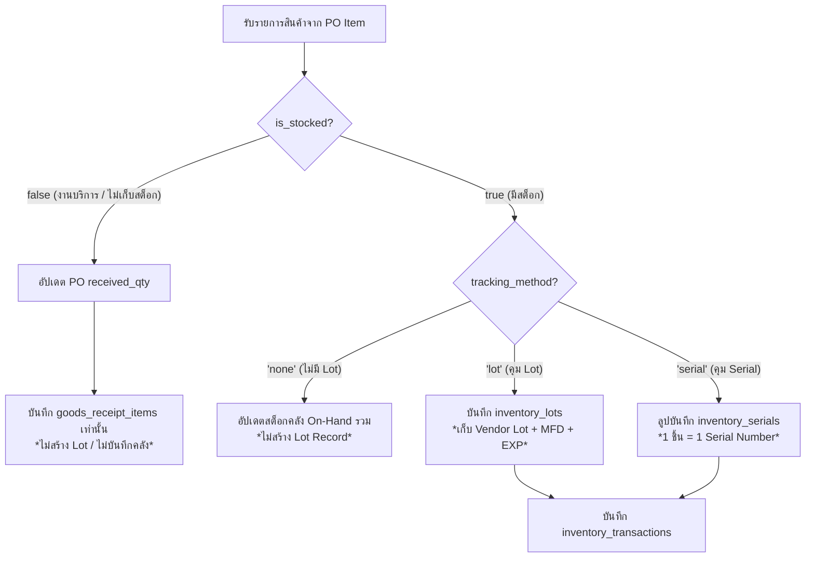
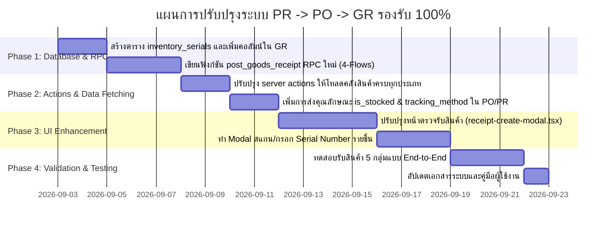

# พิมพ์เขียวการยกระดับระบบจัดซื้อและตรวจรับสินค้า (PR, PO, GR) สู่มาตรฐาน ERP 100%
**Comprehensive Architecture & Implementation Blueprint for PR, PO, and GR Modules**
*เอกสารแนวทางการปรับปรุงระบบจัดซื้อและการรับสินค้าเพื่อรองรับสินค้าและบริการทุกประเภทในปัจจุบันและอนาคต*

---

## 1. บทนำและวัตถุประสงค์ (Executive Summary)

### 1.1 ที่มาและปัญหาปัจจุบัน
ระบบจัดซื้อเดิมของ KRC-ERP ได้รับการพัฒนาโดยเน้น **วัตถุดิบ (Raw Materials)** เป็นหลัก ต่อมาเมื่อมีการควบรวมระบบเข้าสู่ **Item Master (ตารางสินค้าและบริการกลาง)** ทำให้ระบบต้องรองรับสินค้าที่มีธรรมชาติแตกต่างกันหลากหลายประเภท:
1. **สินค้ามีสต็อก (Stocked Items)**: วัตถุดิบ (RM), ชิ้นงานระหว่างทำ (WIP), สินค้าสำเร็จรูป (FG), อะไหล่เครื่องจักร (Spare Parts), วัสดุสิ้นเปลือง (Consumables)
2. **สินค้าไม่มีสต็อก (Non-Stock Items)**: ค่าจ้างแรงงานภายนอก (Subcontract), งานบริการ (Services), ค่าใช้จ่ายดำเนินงาน (Expenses), เครื่องเขียนที่เบิกใช้ทันที
3. **การควบคุมการติดตาม (Tracking Methods)**: ควบคุมด้วย Lot (Lot Controlled), ควบคุมด้วย Serial Number (Serial Controlled), ไม่ควบคุม Lot/Serial (Standard FIFO / Average)

**จุดคอขวดในปัจจุบัน:**
* **หน้า PR และ PO**: รองรับการเลือกสินค้าจาก Item Master ได้ในระดับดี (85-90%) แต่ยังมีข้อจำกัดเรื่องการระบุคลังปลายทางแยกรายบรรทัด
* **หน้า GR (ตรวจรับสินค้า)**: **ยังติดตรรกะเดิมของวัตถุดิบ 100%** บังคับเลือกคลังสินค้า บังคับสร้าง Lot ภายใน และบังคับบันทึกเข้าตารางสต็อก ทำให้ **ไม่สามารถรับสินค้าประเภทบริการ (Non-stock) และไม่รองรับการสแกน/กรอก Serial Number แยกชิ้นได้จริง**

### 1.2 วัตถุประสงค์
เพื่อกำหนดพิมพ์เขียวและรายละเอียดการปรับปรุงทุกส่วนของระบบ (Database, Business Logic/RPC, API Server Actions, และ UI/UX) ให้สามารถรองรับสินค้าทุกประเภทได้อย่างถูกต้อง ไร้ข้อผิดพลาด และพร้อมสำหรับการขยายตัวของธุรกิจในอนาคต

---

## 2. ตารางจำแนกพฤติกรรมสินค้า 5 กลุ่มหลัก (Item Classification Matrix)

ระบบจัดซื้อและตรวจรับจะต้องจัดการสินค้าตามตารางพฤติกรรมนี้:

| กลุ่มสินค้า | ตัวอย่าง | นโยบายสต็อก (`is_stocked`) | การควบคุม (`tracking_method`) | พฤติกรรมเมื่อทำ PR / PO | พฤติกรรมเมื่อทำ GR (ตรวจรับ) |
| :--- | :--- | :---: | :---: | :--- | :--- |
| **กลุ่มที่ 1: วัตถุดิบ/เคมีภัณฑ์** | แผ่นเหล็ก SPCC, สเตนเลส SUS304, สี, ทินเนอร์ | `true` | `'lot'` | ระบุจำนวน, หน่วยนับ, คลังปลายทาง | • ต้องระบุคลังรับเข้า • ต้องให้กรอก **Lot ผู้ผลิต (Vendor Lot)** และ **วันหมดอายุ (Exp Date)** • สร้าง Internal Lot + บันทึก `inventory_lots` |
| **กลุ่มที่ 2: สินค้าคุม Serial** | เครื่องจักร, แม่พิมพ์ (Mold/Die), มอเตอร์, อุปกรณ์ IT | `true` | `'serial'` | ระบุจำนวนเต็ม (จำนวนชิ้น) | • ต้องระบุคลังรับเข้า • ต้องมีช่องให้สแกนหรือระบุ **Serial Number รายชิ้น** (1 หน่วย = 1 Serial) • บันทึกตาราง Serial เพื่อใช้ตามสอบ Warranty |
| **กลุ่มที่ 3: อะไหล่/วัสดุสิ้นเปลือง** | สกรู, น็อต, ดอกสว่าน, เทปกาว, กล่องกระดาษ | `true` | `'none'` | ระบุจำนวน, หน่วยนับ, คลังที่เก็บ | • ต้องระบุคลังรับเข้า • **ไม่ต้องสร้าง Lot** • อัปเดตยอดคงเหลือ On-Hand ในคลังโดยตรง |
| **กลุ่มที่ 4: งานบริการ/จ้างทำของ** | ค่าชุบผิว, จ้างตัดเลเซอร์, ค่าขนส่ง, ค่าบริการซ่อม | `false` | `'none'` | ระบุขอบเขตงาน, ผู้ขอซื้อ, แผนกรับผิดชอบ | • **ไม่ต้องเลือกคลังสินค้า** • **ไม่สร้าง Lot และไม่บันทึกความเคลื่อนไหวสต็อก** • บันทึกยืนยันผลงาน เพื่อส่งต่อยอดไปทำ AP Invoice |
| **กลุ่มที่ 5: ค่าใช้จ่ายตัดจ่ายทันที** | อุปกรณ์สำนักงาน, เครื่องเขียน, อะไหล่ฉุกเฉิน | `false` | `'none'` | ระบุหน่วยนับ, แผนกผู้เบิกใช้งาน | • **ไม่ต้องเลือกคลังสินค้า** • **ไม่บันทึกสต็อก** • รับเข้าแล้วส่งตรงไปยังผู้เบิกทันที |

---

## 3. รายละเอียดสิ่งที่ต้องปรับปรุง: หน้า PR (Purchase Requisition - ใบขอซื้อ)

### 3.1 ด้าน Database & Schema
* ปัจจุบันตาราง `purchase_requisition_items` รองรับ `item_master_id` แล้ว
* **สิ่งที่ต้องเพิ่ม**:
  * เพิ่มคอลัมน์ `is_stocked boolean not null default true` (ดึงอัตโนมัติตามประเภทสินค้า)
  * เพิ่มคอลัมน์ `required_date date` (วันที่ต้องการใช้งานของแต่ละรายการ อาจต่างกัน)
  * เพิ่มคอลัมน์ `target_warehouse_id bigint references warehouses(id)` (ระบุคลังปลายทางที่ต้องการให้ส่งของ ถ้าสินค้านั้นมีสต็อก)

### 3.2 ด้าน UI/UX (`pr-create-modal.tsx`)
* **ตัวเลือกสินค้า (Catalog Picker)**:
  * แสดง Badge สัญลักษณ์แสดงประเภทสินค้าให้ชัดเจน เช่น `[RM - มีสต็อก]`, `[SR - งานบริการ]`, `[SP - อะไหล่]`
  * หากเลือกสินค้าที่เป็นงานบริการ (`is_stocked = false`): ซ่อนหรือ Disable ช่องเลือกคลังสินค้า
* **ตารางรายการในใบขอซื้อ**:
  * เพิ่มคอลัมน์ "วันที่ต้องการ (Required Date)"
  * ปรับข้อความหัวตารางจาก "รหัสวัตถุดิบ" ให้เป็น **"รหัสสินค้า/บริการ"**

### 3.3 ด้าน Server Actions (`purchase-requisitions.ts`)
* ปรับปรุงฟังก์ชัน `get_purchase_requisition_catalog()` ให้ส่งคุณลักษณะ `is_stocked`, `tracking_method`, และ `form_template` ออกมาด้วย เพื่อให้หน้าบ้านใช้เปิด/ปิดฟิลด์ได้อย่างถูกต้อง

---

## 4. รายละเอียดสิ่งที่ต้องปรับปรุง: หน้า PO (Purchase Order - ใบสั่งซื้อ)

### 4.1 ด้าน Database & Schema
* ตาราง `purchase_order_items`:
  * เพิ่มคอลัมน์ `is_stocked boolean not null default true`
  * เพิ่มคอลัมน์ `tracking_method text default 'none'`
  * ยืนยันการมีอยู่ของ `warehouse_id` รายบรรทัด (Line-level Warehouse) เพื่อรองรับกรณี PO ใบเดียว แต่ส่งเข้าหลายคลัง (เช่น สินค้าส่งคลัง A, อะไหล่ส่งคลัง B)

### 4.2 ด้าน UI/UX (`po-create-modal.tsx`)
* **การแปลงจาก PR -> PO (PR Conversion)**:
  * คัดลอกข้อมูล `is_stocked` และ `tracking_method` จาก PR ลงใน PO Item โดยอัตโนมัติ
* **การคุมความถูกต้อง (Validation)**:
  * ถ้าเป็นรายการที่มีสต็อก (`is_stocked = true`): บังคับให้ต้องมีคลังปลายทาง
  * ถ้าเป็นรายการงานบริการ (`is_stocked = false`): ปลดล็อกไม่ต้องเลือกคลัง และแสดงข้อความกำกับว่า *"งานบริการ/ไม่มีสต็อก"*

### 4.3 ด้านเอกสารพิมพ์ (`po-print-preview-modal.tsx`)
* รองรับการแสดงรายละเอียดงานบริการ (Scope of Work / Description) ได้หลายบรรทัดโดยไม่ตัดคำ
* ปรับหัวตารางให้เป็นมาตรฐานสากล: **"รหัสรายการ (Item Code)"**, **"รายละเอียด (Description)"**

---

## 5. รายละเอียดสิ่งที่ต้องปรับปรุง: หน้า GR (Goods Receipt - ใบตรวจรับสินค้า)
*(นี่คือจุดที่ต้องปรับปรุงมากที่สุดและสำคัญที่สุดในระบบ)*

### 5.1 ด้าน Database & Core RPC Function (`post_goods_receipt`)
ต้องเขียนฟังก์ชัน `public.post_goods_receipt(...)` ใหม่ให้รองรับ 4 เส้นทาง (Flows) ตามประเภทสินค้า:

#### การปรับโครงสร้างตารางฐานข้อมูล:
1. **ตาราง `goods_receipt_items`**:
   * เพิ่ม `vendor_lot_no text` (เลข Lot ของผู้ผลิต)
   * เพิ่ม `mfg_date date` (วันที่ผลิต)
   * เพิ่ม `expiry_date date` (วันหมดอายุ)
   * เพิ่ม `is_stocked boolean not null default true`
   * เพิ่ม `tracking_method text not null default 'none'`
2. **ตาราง `inventory_serials` (สร้างใหม่เพื่อรองรับ Serial Number)**:
   * `id bigint generated always as identity primary key`
   * `item_master_id bigint not null references item_master(id)`
   * `serial_number text not null`
   * `warehouse_id bigint not null references warehouses(id)`
   * `goods_receipt_id bigint references goods_receipts(id)`
   * `status text not null default 'in_stock' check (status in ('in_stock', 'allocated', 'consumed', 'scrapped'))`
   * `unique (item_master_id, serial_number)`
3. **ตาราง `inventory_lots`**:
   * เพิ่มคอลัมน์ `vendor_lot_no text`
   * เพิ่มคอลัมน์ `mfg_date date`
   * เพิ่มคอลัมน์ `expiry_date date`

### 5.2 ด้าน UI/UX หน้าต่างรับสินค้า (`receipt-create-modal.tsx`)
ต้องปรับปรุงหน้าตรวจรับสินค้า (Step 2) ให้เป็นแบบไดนามิก:

1. **การเลือกคลังสินค้า (Warehouse Selector)**:
   * ปลดล็อกคลังที่ Header ไม่ให้เป็นตัวบังคับรวมทุกรายการ
   * อนุญาตให้กำหนดคลังรายบรรทัด หรือมีปุ่ม "ใช้คลังนี้กับทุกรายการ"
   * ในแถวที่เป็นงานบริการ (`is_stocked = false`): แสดง Badge สีเทาว่า `ไม่ต้องระบุคลัง (Non-stock)` และปิดการเลือกคลัง
2. **การจัดการ Lot Number**:
   * สำหรับสินค้า `tracking_method = 'lot'`:
     * มีช่องให้กรอก **"Lot ผู้ผลิต (Supplier Lot)"**
     * มีช่องให้กรอก **"วันหมดอายุ (Exp Date)"**
     * มีช่องแสดงเลข Lot ภายในของระบบ (Auto-generated KRC Lot)
3. **การจัดการ Serial Number**:
   * สำหรับสินค้า `tracking_method = 'serial'`:
     * ถ้าใส่จำนวนรับ 3 ชิ้น จะมีปุ่ม/ป๊อปอัปให้ **"สแกน/กรอก 3 Serial Numbers"**
     * มีระบบตรวจสอบ Serial ซ้ำในฐานข้อมูลทันที (Duplicate Check)
4. **การโหลดคลังสินค้าในหน้า `receipts/page.tsx`**:
   * เปลี่ยนจากการเรียก `getRawMaterialWarehousesAction()` มาเป็น `getWarehousesAction()` เพื่อให้ดึงคลังได้ **ครบทุกประเภท** (คลังสินค้าสำเร็จรูป, คลังอะไหล่, คลังวัตถุดิบ)

### 5.3 ด้านเอกสารและประวัติย้อนกลับ (Traceability & Print Preview)
* ในใบรับสินค้า (GR Print Preview):
  * ถ้าเป็น Lot ให้แสดงทั้ง KRC Lot และ Vendor Lot
  * ถ้าเป็น Serial ให้แสดงรายการ Serial Numbers แนบท้ายรายการ
  * ถ้าเป็นงานบริการ ให้แสดงระบุชัดเจนว่าเป็น "ใบตรวจรับงานจ้าง/บริการ"

---

## 6. แผนที่นำทางและลำดับการพัฒนา (Implementation Roadmap)

เพื่อความปลอดภัยสูงสุดและไม่กระทบการทำงานเดิม แนะนำให้แบ่งการพัฒนาเป็น 4 ระยะ:

### รายละเอียดแต่ละเฟส:
* **Phase 1: ปรับโครงสร้างข้อมูลเบื้องหลัง (Database & RPC)**
  * สร้าง Migration เพิ่มคอลัมน์ `vendor_lot_no`, `expiry_date` และสร้างตาราง `inventory_serials`
  * ปรับปรุงฟังก์ชัน `post_goods_receipt` ให้ตรวจเช็ก `is_stocked` และ `tracking_method` เพื่อไม่ให้ติด Error เมื่อรับงานบริการ
* **Phase 2: ปรับปรุงส่วนเชื่อมต่อข้อมูล (Server Actions)**
  * แก้ไข `src/app/actions/inventory.ts` และ `src/app/(dashboard)/purchase/receipts/page.tsx` ให้โหลดคลังสินค้าทุกประเภท
* **Phase 3: ปรับปรุงหน้าจอผู้ใช้งาน (UI/UX)**
  * ปรับหน้าต่างรับสินค้าให้รองรับการคีย์ Lot ผู้ขาย, วันหมดอายุ, และการสแกน Serial Number
  * ปรับข้อความหัวตารางให้เป็นกลางตามมาตรฐาน ERP
* **Phase 4: ทดสอบระบบครบวงจร (Verification)**
  * ทดสอบ Flow ซื้อและรับสินค้า 5 รูปแบบ (RM, FG, Spare Parts, Service, Expense)
  * ตรวจสอบว่ายอดในคลังและรายงานสต็อกเคลื่อนไหวอย่างแม่นยำ 100%

---

## 7. ประโยชน์ที่จะได้รับเมื่อปรับปรุงสมบูรณ์

1. **รองรับสินค้าทุกประเภท 100%**: ระบบจะสามารถออก PO และตรวจรับงานบริการ (เช่น ค่าจ้างชุบ, ค่าซ่อม) ได้อย่างราบรื่นโดยไม่เกิด Error บังคับเลือกคลัง
2. **การสอบย้อนกลับระดับอุตสาหกรรม (Full Traceability)**: สามารถสืบค้นได้ทันทีว่า ชิ้นงานล็อตนี้ ใช้เหล็กจากผู้ผลิต Lot ใด และตรวจรับเข้ามาตามใบส่งของ DN ใด
3. **การคุมครุภัณฑ์และแม่พิมพ์ (Asset & Serial Control)**: ทราบประวัติและสถานะของเครื่องจักรหรือแม่พิมพ์แต่ละตัวผ่านหมายเลข Serial Number ประจำชิ้น
4. **ความถูกต้องของบัญชีและคลังสินค้า**: ข้อมูลยอดสต็อกในคลังจะไม่ถูกปนเปื้อนด้วยรายการบริการหรือค่าใช้จ่าย
