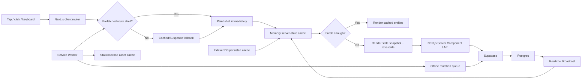
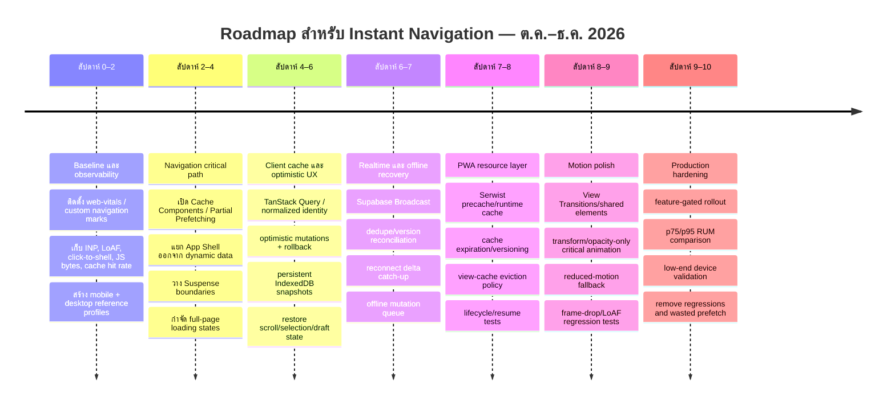

# รายงานเชิงลึก: สถาปัตยกรรมและเทคนิคสำหรับการนำทางแบบ “Instant, Ultra‑Smooth” ในแอปสมัยใหม่ ณ ปี 2026

## บทสรุปผู้บริหาร

ประสบการณ์ที่ผู้ใช้รู้สึกว่า “แตะแล้วไปทันที” แบบแอประดับโลกไม่ได้เกิดจาก animation ที่สวยเพียงอย่างเดียว แต่เกิดจากการจัด **critical path ของการนำทาง** ใหม่ทั้งหมด: รับ input → ให้ visual response ทันที → แสดง shell หรือ snapshot ที่พร้อมอยู่แล้ว → รักษา state เดิม → ใช้ข้อมูลใน local cache → stream หรือ synchronize ข้อมูลใหม่ภายหลัง โดยไม่บังคับให้ network round trip อยู่บนเส้นทางก่อน first paint ของหน้าถัดไป หลักการนี้สอดคล้องโดยตรงกับแนวทาง “instant navigation” ของ Next.js รุ่นปัจจุบัน ซึ่งนิยาม navigation ว่า instant เมื่อ browser เริ่ม render หน้าปลายทางได้ทันทีจาก static/cached/fallback content แล้วจึง stream ส่วนที่เหลือเข้ามา และกับ INP ซึ่งวัดเวลาจาก interaction จนถึง next paint ไม่ใช่จน network operation ทั้งหมดเสร็จสิ้น. citeturn8view3turn15view0

สำหรับ stack **Next.js + Supabase + TypeScript + PWA** ข้อเสนอหลักของรายงานนี้คือ:

> **Cache the shell → prefetch likely destinations → preserve local state → paint immediately → stream/fetch fresh data → reconcile in background.**

ใน Next.js ปี 2026 แนวทางที่ตรงที่สุดคือ **App Router + React Server Components + Cache Components + Partial Prefetching + Suspense streaming** แทนการเลือกสุดขั้วระหว่าง “SSR ทุกอย่าง” กับ “SPA ทุกอย่าง” เพราะ App Shell ที่ cache ได้สามารถถูก prefetch เพียงครั้งเดียวต่อ route และนำกลับมาใช้กับหลาย link ขณะที่ dynamic content ค่อย stream ตามมาได้. Next.js ยังมี tooling สำหรับตรวจ navigation ที่ block และทดสอบ instant navigation ใน CI. citeturn1search24turn8view3

ฝั่ง client ควรมี **server-state cache** เช่น TanStack Query และ state เล็ก ๆ สำหรับ UI/session state แยกต่างหาก; route ที่เคยเปิดควรสามารถกลับมาได้จาก snapshot/cache โดยไม่ต้องรอ fetch ใหม่. React รุ่นปัจจุบันมี `<Activity>` สำหรับซ่อน UI โดยยังเก็บ internal state ไว้ และ `<ViewTransition>` สำหรับประสาน animation รวมถึง shared-element transitions; `useOptimistic` ช่วย render pending state ทันทีและ rollback กลับสู่ base state เมื่อ action ล้มเหลว. citeturn8view0turn8view1turn7view0

Supabase Realtime ควรใช้เพื่อ **invalidate หรือ patch cache** ไม่ใช่แทน durable local database ทั้งหมด. เอกสาร Supabase ปีปัจจุบันแนะนำ **Broadcast** มากกว่า Postgres Changes สำหรับงานที่ต้องการ scalability/security สูง โดย event จากฐานข้อมูลสามารถถูกส่งผ่าน trigger และกระจายผ่าน WebSocket ไปยัง clients ได้. citeturn5view0turn5view1

Service Worker ควรทำหน้าที่แคบและชัดเจน: precache app/static shell, runtime-cache ทรัพยากรที่เหมาะสม, queue งานที่เขียนข้อมูลเมื่อ offline และช่วย cold/warm reload แต่ไม่ควรกลายเป็น “ฐานข้อมูลอีกชุดหนึ่งที่มี business logic เต็มระบบ”. Service Workers เป็น event-driven workers ที่มี lifecycle ซึ่ง browser ควบคุม จึงไม่ควรออกแบบโดยสมมติว่าจะทำงานใน background ตลอดเวลา. Serwist ซึ่งเหมาะกับ Next.js รองรับ precaching และกลยุทธ์อย่าง `StaleWhileRevalidate`, `NetworkFirst` และ `CacheFirst`. citeturn2search21turn6search5turn6search10

หลักฐานจากแอประดับใหญ่สนับสนุนภาพนี้อย่างชัดเจน. Dropbox เปลี่ยน core file browser ให้เป็น SPA บนสถาปัตยกรรม Edison พร้อม isomorphic rendering; ในอีกโครงการหนึ่งลด JavaScript bundle ลง **33%** และจำนวน scripts ลง **15%** ด้วย automatic code splitting/tree shaking แต่พบด้วยว่าการแตก chunk มากเกินไปทำให้ module discovery และ compression แย่ลง. การทดลอง HTTP/3 ของ Dropbox พบ network-latency improvement ราว **21% ที่ p95** โดยในเอเชียลดได้ถึงประมาณ **200 ms ที่ p95**—เป็นตัวอย่างว่าความเร็วที่ผู้ใช้รู้สึกไม่ได้ถูกกำหนดด้วย React/rendering เพียงด้านเดียว. citeturn20view2turn20view0turn20view1

> **ข้อจำกัดที่ยังไม่ระบุ:** target platforms, device classes และ acceptable bundle-size budget ยังไม่ถูกกำหนด ดังนั้นตัวเลข SLO ภายในที่รายงานนี้เสนอควรถือเป็น *starting targets* ไม่ใช่มาตรฐานสากล. ควรแบ่ง RUM อย่างน้อยเป็น mobile/desktop และต่อไปแยกตาม device/network tier; Core Web Vitals เองก็กำหนดให้ดูที่ percentile 75 แยก mobile และ desktop. citeturn15view1

## รูปแบบที่ทำให้แอประดับโลกดูเหมือนตอบสนองทันที

คำว่า “instant” ควรแยกออกเป็นอย่างน้อยสามกรณี: **cold entry**, **warm in-app navigation**, และ **resume/back navigation**. ทั้งสามกรณีต้องใช้เทคนิคต่างกัน. Cold entry ต้องจัดการ HTML/RSC/JS และ hydration; warm navigation ควรใช้ prefetched shell + cached data; ส่วน back/resume ควร restore สิ่งที่ผู้ใช้เห็นก่อนหน้าแทบจะทันที. Browser มี back/forward cache ซึ่งเก็บ page state แล้ว restore โดยไม่ต้องสร้างหน้าขึ้นใหม่ทั้งหมดเมื่อเงื่อนไขอนุญาต ทำให้ back/forward navigation เข้าใกล้ instant ได้. citeturn3search6

หลักสำคัญคือ **อย่าให้ correctness dependency ทั้งหมดอยู่ก่อน first visual response**. หลังผู้ใช้กด “เปิด conversation”, UI ไม่ควรรอ `SELECT …` จากฐานข้อมูลก่อนเปลี่ยนหน้าจอ ถ้ามีข้อมูลล่าสุดอยู่ใน memory/IndexedDB อยู่แล้ว. สิ่งที่ควรเกิดคือเปลี่ยน selection/navigation state, paint cached conversation, แสดง pending/stale indicator ที่ละเอียดอ่อนถ้าจำเป็น แล้วจึง revalidate จาก Supabase. นี่เป็น stale-while-revalidate ในระดับ application state มากกว่าการใช้ skeleton ทุกครั้ง. TanStack Query มี persistence API สำหรับเก็บ query cache และสามารถใช้ IndexedDB persister เพื่อ restore cache ข้าม reload/session ได้. citeturn6search4

### เทคนิค UX ที่ควรใช้เมื่อไร

| เทคนิค | ทำไมจึงรู้สึกเร็ว | คำแนะนำสำหรับ stack นี้ | ความเสี่ยง / trade-off |
|---|---|---|---|
| **Prefetched App Shell** | ไม่ต้องสร้างโครงหน้าหลัง click | ให้ `<Link>`/Next router prefetch route shell; Partial Prefetching reuse shell ต่อ route. citeturn1search0turn1search24 | Prefetch มากเกินไปสิ้นเปลือง data/CPU |
| **View caching / state preservation** | กลับหน้าก่อนหน้าโดยไม่ต้อง reconstruct UI | React `<Activity>` หรือ local route cache/snapshot; hidden Activity เก็บ state แต่หยุด effects/subscriptions แล้วสร้างใหม่เมื่อ visible. citeturn8view0 | เก็บ DOM/state มากเกินไปใช้ memory สูง |
| **Shared-element transition** | ทำให้ผู้ใช้รับรู้ว่ารายการเดิม “ต่อเนื่อง” ไปสู่ detail | React `<ViewTransition>` หรือ browser View Transitions API แบบ progressive enhancement. citeturn8view1turn3search32 | animation แพงจะทำให้ประสบการณ์ช้ากว่าไม่มี animation |
| **Optimistic UI** | action ดูเสร็จก่อน server round trip | `useOptimistic` หรือ optimistic query mutation + rollback/reconcile. citeturn7view0 | conflict, duplicate events, RLS rejection ต้องจัดการ |
| **Skeleton** | ให้โครงสร้างก่อน data พร้อม | ใช้เฉพาะพื้นที่ที่ยังไม่มี cache และรักษาขนาดใกล้ content จริงเพื่อป้องกัน layout shift. CLS ที่ดีคือ ≤0.1 ที่ p75. citeturn15view1 | skeleton flash สั้น ๆ ทำให้หน้าดู *ช้าลง* |
| **Streaming fallback** | shell มาก่อน data ช้า | `<Suspense>` รอบ dynamic islands เพื่อให้ static/cacheable shell render ก่อน. citeturn8view3 | boundary ละเอียดเกินไปทำให้ UI กระพริบ/ซับซ้อน |
| **Immediate pressed/selected state** | feedback เกิดใน frame แรก | update local UI state ก่อนงาน async; งาน non-urgent ใช้ transition. React transitions สามารถถูก interrupt โดย urgent input. citeturn8view2 | อย่า mark งานที่ต้องตอบ input โดยตรงเป็น background transition ทั้งหมด |

สิ่งที่ควรหลีกเลี่ยงคือ pattern “click → spinner เต็มหน้า → fetch → render”. Spinner เต็มหน้าทำลาย continuity และทิ้ง cache/state ที่มีอยู่โดยเปล่าประโยชน์. ในแอปที่ผู้ใช้เดินไปมาระหว่าง inbox/chat/document/dashboard บ่อย ๆ เป้าหมายควรเป็น **old screen remains valid until new shell is paintable** หรือ **new shell appears from cache immediately**, ไม่ใช่ blank state ระหว่างสองหน้า. แนวคิดนี้ตรงกับ model ของ Next.js ที่แยก App Shell ออกจาก dynamic streamed content. citeturn8view3

Dropbox เป็นกรณีศึกษาที่น่าสนใจเพราะ core file browser เปลี่ยนไปสู่ SPA เพื่อให้ surface ขนาดใหญ่มากสามารถนำทางโดยไม่ reload document ทุกครั้ง และ Edison รองรับ isomorphic rendering ขณะเดียวกัน. นี่ชี้ให้เห็นว่า “SPA-like navigation” และ server rendering ไม่จำเป็นต้องเลือกอย่างใดอย่างหนึ่ง; สถาปัตยกรรมสมัยใหม่มักรวมข้อดีของทั้งสองฝั่ง. citeturn20view2

## สถาปัตยกรรมที่แนะนำสำหรับ Next.js, Supabase และ PWA

สำหรับโปรเจกต์ใหม่หรือโปรเจกต์ที่กำลังปรับปรุงในปลายปี 2026 ผมแนะนำให้คิดเป็น **สี่ชั้น latency hiding**: route shell, memory cache, persistent cache และ realtime/network reconciliation. ข้อมูลที่จำเป็นต่อ first meaningful screen ควรหาได้จากอย่างน้อยหนึ่งในสามชั้นแรกโดยไม่ต้องรอ request ใหม่ เว้นแต่เป็นข้อมูลที่ต้องสดและ sensitive จริง ๆ. Next.js Partial Prefetching ถูกออกแบบให้ prefetch static/cached App Shell ของ route และ stream ส่วนที่ขึ้นกับ runtime ตามมาทีหลัง. citeturn1search24turn8view3



**Next.js layer.** Next.js รุ่นปัจจุบันมีแนวคิด Cache Components/Partial Prefetching ซึ่งทำให้ static/cached content ถูกสร้างเป็น App Shell และ dynamic content อยู่หลัง Suspense boundary. สำหรับ client navigation ลิงก์ที่มองเห็นสามารถ prefetch shell ที่ใช้ร่วมกันได้; ถ้าใช้ `prefetch={true}` จะดึงข้อมูลเฉพาะ URL เพิ่มล่วงหน้าได้ในกรณีที่มีความมั่นใจสูงว่าผู้ใช้จะไปหน้านั้น. citeturn8view3turn1search24

```ts
// next.config.ts
import type { NextConfig } from "next";

const nextConfig: NextConfig = {
  cacheComponents: true,
  partialPrefetching: true,
};

export default nextConfig;
```

ค่าทั้งสองเป็นแนวทางที่เอกสาร Next.js ปี 2026 ระบุสำหรับการได้ instant navigation เต็มรูปแบบ. อย่างไรก็ดี การเปิด feature ไม่ได้แก้ route ที่มี async dependency blocking อยู่เหนือ Suspense boundary; ต้องย้ายงานนั้นเข้า cache หรือครอบด้วย boundary เพื่อให้ App Shell เกิดขึ้นจริง. citeturn8view3

รูปแบบ page ที่เหมาะกว่าการรอทั้งหน้าเป็นดังนี้:

```tsx
// app/projects/[id]/page.tsx
import { Suspense } from "react";
import { ProjectShell } from "./project-shell";
import { LiveProjectData } from "./live-project-data";

export default async function ProjectPage({
  params,
}: {
  params: Promise<{ id: string }>;
}) {
  const { id } = await params;

  return (
    <ProjectShell projectId={id}>
      <Suspense fallback={<ProjectContentSkeleton />}>
        <LiveProjectData projectId={id} />
      </Suspense>
    </ProjectShell>
  );
}
```

หลักไม่ได้อยู่ที่จำนวน `<Suspense>` แต่คือ **boundary ต้องตรงกับ latency boundary ของผลิตภัณฑ์**. Navigation/sidebar/header/toolbar ที่ cache ได้ไม่ควรถูก block เพราะ comment feed หรือ analytics panel ต้อง query database. Next.js ระบุชัดว่าพื้นที่ runtime/dynamic สามารถ stream หลัง fallback ขณะที่ shell ใช้ในการ client navigation และ partial prefetch ได้. citeturn8view3

### Rendering strategy ที่ควรเลือก

| Strategy | เหมาะกับ | Navigation behavior | ข้อแลกเปลี่ยน |
|---|---|---|---|
| **Client-side routing** | app surfaces ที่ผู้ใช้นำทางถี่มาก | ไม่ reload document; state/cache อยู่ต่อได้ | client JS และ memory สูงขึ้นถ้าไม่แบ่ง route |
| **React Server Components** | data-heavy UI ที่ logic ไม่จำเป็นต้องส่ง browser | ลด JS ที่ต้อง execute ฝั่ง client; Next.js ใช้ RSC เป็นแกนของ App Router. citeturn1search3 | server dependency ยังสร้าง latency ถ้าไม่ cache/stream |
| **Streaming SSR / RSC** | หน้าเดียวมีทั้งส่วนเร็วและช้า | shell/fallback มาก่อน แล้ว dynamic segments ตามมา. citeturn8view3 | boundary orchestration และ error handling ซับซ้อน |
| **ISR / cacheable server output** | public/read-mostly content ที่ stale ได้ | warm route ถูกเสิร์ฟเร็วมากจาก cache | ไม่เหมาะกับ per-user volatile state |
| **Cache Components + Partial Prefetching** | interactive Next.js app ปี 2026 | ได้ hybrid ระหว่าง static shell กับ streamed dynamic content. citeturn1search24turn8view3 | ต้องออกแบบ cache boundary อย่างตั้งใจ |
| **Edge rendering** | request ที่ logic/data dependency อยู่ใกล้ edge หรือ cache ได้ | ลด user→compute RTT | ถ้า compute อยู่ใกล้ user แต่ต้องวิ่งกลับ DB origin ทุก request อาจไม่ได้เร็วขึ้น |
| **Pure CSR screen** | screen ที่ data อยู่ client อยู่แล้ว เช่น canvas/editor/stateful workspace | soft navigation สามารถ instant มาก | initial JS, hydration/startup, SEO และ memory อาจแพงกว่า |

Next.js เองระบุว่า soft navigation ไปยังหน้า `"use client"` สามารถมีพฤติกรรมแบบ SPA และไม่ต้อง server-render ที่ navigation time แต่เอกสารยังชี้ว่ามีผลกระทบกว้างกว่า และ model ของ Server Components ยังเป็น default ที่เหมาะสมกว่าโดยทั่วไป. ดังนั้นไม่ควรแก้ performance ด้วยการเปลี่ยนทั้งระบบเป็น client component; ให้ทำเฉพาะ highly-stateful islands. citeturn8view3

**Edge rendering ต้องใช้ตาม topology ไม่ใช่ตามชื่อ.** การทดลองของ Dropbox แสดงให้เห็นว่า network distance และ network tail latency มีผลอย่างมาก โดย p95 ของผู้ใช้เอเชียแตกต่างมากกว่าค่ากลาง. จากหลักฐานนี้จึงอนุมานได้ว่า render worker ที่ edge จะมีประโยชน์จริงก็ต่อเมื่อ upstream data ไม่สร้าง long-haul RTT กลับ origin ทุกครั้ง; มิฉะนั้นควร cache data/output หรือวาง compute ให้สอดคล้องกับ data locality มากกว่าเลือก “edge” โดยอัตโนมัติ. citeturn20view1

## เครือข่าย สถานะ แคช และ lifecycle ที่ทำให้การสลับหน้าไม่สะดุด

สำหรับ app-like web application ควรแยก **server state** กับ **ephemeral UI state**. Server state เช่น projects/messages/files ควรมี cache, freshness policy, retry, invalidation และ persistence; UI state เช่น selected tab, panel size, compose draft และ scroll anchor ไม่จำเป็นต้องถูกผูกกับ fetch library ทุกอย่าง. การแยกนี้ช่วยให้ navigation ไม่ trigger database round trip โดยไม่จำเป็น และทำให้ snapshot/restore ง่ายขึ้น. TanStack Query รองรับ persisted query cache และ documentation ยก IndexedDB เป็นตัวเลือกสำหรับ persistence ที่มากกว่า Web Storage. citeturn6search4

รูปแบบ state ที่เหมาะคือ:

```text
Server source of truth
        │
        ▼
Supabase/Postgres
        │
 ┌──────┴─────────┐
 │                │
Query/fetch       Realtime Broadcast
 │                │
 ▼                ▼
Normalized in-memory cache
        │
 ┌──────┼─────────────┐
 ▼      ▼             ▼
Screen A Screen B   Optimistic layer
        │
        ▼
IndexedDB snapshot/persistence
```

**Normalized entities** ช่วยลดปัญหาแต่ละ screen เก็บสำเนา object เดียวกันคนละชุด. แทนที่จะ cache `"project-list"` และ `"project-detail"` เป็น object ที่ไม่มีความสัมพันธ์กัน ให้ identity หลักเป็น `project:${id}` แล้ว views เก็บ ID/order/filter เป็นหลัก. เมื่อ Realtime event แก้ project เดียว ทุกหน้าที่แสดง entity นั้นสามารถ converge ไปยัง state เดียวกันได้. สำหรับแอปที่ข้อมูลไม่เป็น graph ซับซ้อน TanStack Query cache อย่างเดียวก็เพียงพอ; อย่าสร้าง Redux-style normalized graph ถ้าไม่ได้แก้ปัญหาจริง.

**Optimistic mutation** ควรมี mutation ID หรือ client-generated UUID และสามารถ rollback/reconcile ได้. React `useOptimistic` ถูกออกแบบมาให้ optimistic value ปรากฏระหว่าง action และกลับไปยัง base state เมื่อ operation จบหรือ fail. citeturn7view0

ตัวอย่าง pattern กับ Supabase:

```ts
type Todo = {
  id: string;
  text: string;
  completed: boolean;
  pending?: boolean;
};

async function createTodoOptimistically(text: string) {
  const id = crypto.randomUUID();

  const optimistic: Todo = {
    id,
    text,
    completed: false,
    pending: true,
  };

  // Paint first; network second.
  queryClient.setQueryData<Todo[]>(["todos"], (old = []) => [
    optimistic,
    ...old,
  ]);

  const { data, error } = await supabase
    .from("todos")
    .insert({ id, text, completed: false })
    .select()
    .single();

  if (error) {
    queryClient.setQueryData<Todo[]>(["todos"], (old = []) =>
      old.filter((todo) => todo.id !== id),
    );
    throw error;
  }

  queryClient.setQueryData<Todo[]>(["todos"], (old = []) =>
    old.map((todo) => (todo.id === id ? data : todo)),
  );
}
```

การใช้ ID เดียวกันระหว่าง optimistic entity และ server row ลด reconciliation ambiguity. แต่ optimistic UI ต้องไม่ถูกตีความว่า server ยืนยันแล้ว: authorization/RLS, validation, unique constraints หรือ business rule ยังสามารถปฏิเสธ mutation ได้ จึงต้องมี error state และ rollback/reconcile เสมอ. Realtime event ที่เข้ามาซ้ำกับ mutation response ก็ควรถูก deduplicate ด้วย entity version/ID หรือ mutation identity. Supabase Realtime รองรับการส่ง database-change events ผ่าน Broadcast และ WebSocket ไปยัง subscribed clients. citeturn5view0turn5view1

**Realtime ไม่เท่ากับ offline synchronization.** เมื่อ client หายไปจาก network ไม่ควรสมมติว่าจะได้รับ event ทุกตัวภายหลัง. Pattern ที่แข็งแรงกว่าคือ Realtime ใช้เพื่อ *ลด staleness ขณะ online* ส่วน reconnect ทำ durable catch-up ผ่าน `updated_at`, monotonic version, change-log cursor หรือ server revision; ถ้าต้อง sync deletion ด้วยต้องมี tombstone/change log แทนการ query “แถวที่ยังอยู่” อย่างเดียว. นี่เป็น architecture recommendation ที่สำคัญมากสำหรับ PWA ที่อาจถูก suspend ระหว่าง app switch.

Supabase ระบุว่ามีสองแนวทางหลักสำหรับ database changes และแนะนำ Broadcast สำหรับ use case ส่วนใหญ่ที่ต้องการ scalability/security มากกว่า ขณะที่ Postgres Changes ใช้ง่ายกว่าแต่มี scaling limitations. ดังนั้นระบบที่มี feed/chat/collaboration จำนวนมากควรออกแบบ Broadcast channel และ subscription scope อย่างรอบคอบ แทน subscribe ตารางใหญ่แบบ global. citeturn5view0

### Cache strategy ที่แนะนำ

| Resource | กลยุทธ์ | เหตุผล |
|---|---|---|
| Versioned JS/CSS/fonts | **CacheFirst / precache** | immutable content เหมาะกับ cache ระยะยาว; Serwist มี precaching/version handling. citeturn6search5 |
| App shell/static icons | **Precache** | ทำให้ reopen/offline shell เร็ว |
| Public relatively-stale API | **StaleWhileRevalidate** | cache ตอบก่อน แล้ว refresh network; Serwist รองรับ strategy นี้โดยตรง. citeturn6search10 |
| User-sensitive API | **NetworkFirst หรือ app-level cache** | ลดความเสี่ยงเอาข้อมูลเก่าหรือคนละ auth context |
| Mutation | **NetworkOnly + explicit offline queue** | response ต้องมาจาก source of truth; offline queue ต้องมี idempotency |
| Large media | **CacheFirst/expiration ตาม access pattern** | cache เฉพาะสิ่งที่คุ้ม storage |
| Supabase realtime | **WebSocket + reconnect catch-up** | realtime สำหรับ freshness; durable query สำหรับ gap recovery. citeturn5view1 |

Service Worker ไม่ควร cache authenticated JSON ด้วย rule กว้างอย่าง `StaleWhileRevalidate` โดยไม่ได้คิดถึง user/session/cache-key เพราะเสี่ยง privacy และ stale authorization. ให้ persistent application cache อยู่ใน IndexedDB/TanStack Query ซึ่งเข้าใจ entity/session มากกว่า ส่วน Service Worker cache เน้น static resources และ explicitly safe GET responses.

**Prefetch ต้องเป็น probabilistic investment.** Next.js prefetch visible links อัตโนมัติในหลายกรณี และ Partial Prefetching ช่วยลดต้นทุนโดย prefetch shared App Shell แทนข้อมูลเฉพาะ URL ทุกลิงก์. สำหรับ expensive detail routes ให้เพิ่ม intent prefetch จาก hover/focus/pointer-down หรือ prefetch เฉพาะ top-N predicted destinations มากกว่าดึงทุก row ใน list. citeturn1search0turn1search24

กรณีศึกษาของ Dropbox เตือนอีกด้านหนึ่งของ optimization: automatic code splitting ช่วยให้ browser ดาวน์โหลดเฉพาะ code ที่จำเป็นและ reuse shared chunks จาก cache แต่เมื่อแบ่งออกเป็น chunks มากเกินไป Dropbox พบ module-discovery overhead และ compression efficiency ที่ลดลง. ผลสุดท้ายหลัง rollout คือ bundle size ลด 33% และ script count ลด 15%. ดังนั้นเป้าหมายไม่ใช่ “chunk เล็กที่สุดเท่าที่ทำได้” แต่เป็น **critical route JS ต่ำ + shared chunk reuse สูง + request graph ไม่แตกละเอียดเกินไป**. citeturn20view0

## การจัดการทรัพยากร PWA บนมือถือและเดสก์ท็อป

สิ่งที่ PWA ควบคุมได้สำหรับ “app-to-app switching” แตกต่างจาก native app. Browser/OS เป็นผู้ควบคุม process suspension, task switching และ memory reclamation; เว็บแอปจึงไม่สามารถรับประกันว่าหน่วยความจำทั้งหมดจะยังอยู่หลังผู้ใช้สลับไปแอปอื่น. สิ่งที่ควร optimize คือ **resume path**: สิ่งที่เห็นก่อน background ต้อง restore ได้จาก browser state, bfcache หรือ persisted snapshot ก่อน network refresh. bfcache สามารถ pause page แล้วนำ page กลับมาโดยไม่ต้องสร้าง document ใหม่สำหรับ back/forward navigation เมื่อเข้าเงื่อนไข. citeturn3search6

Service Worker ก็ไม่ใช่ daemon. Specification ออกแบบ worker แบบ event-driven และ browser สามารถ terminate worker เมื่อไม่มีงานได้ ดังนั้น background jobs ต้องสามารถหยุด/เริ่มใหม่และ idempotent ได้. Queue mutation ลง IndexedDB ก่อน แล้ว flush เมื่อมีโอกาส; Background Sync API ใช้เป็น enhancement ได้ แต่ core correctness ควรยังทำงานได้ผ่าน reconnect/focus retry เมื่อ API ดังกล่าวไม่มีหรือถูกจำกัด. citeturn2search21

**Mobile PWA** ควรถือ CPU, memory และ network เป็นทรัพยากรจำกัด. การ cache DOM tree ของทุก route ตลอดเวลาสามารถเปลี่ยน “navigation เร็ว” ให้กลายเป็น memory pressure และ garbage-collection jank. วิธีที่เหมาะกว่าคือเก็บ 1–3 recent high-value surfaces หรือใช้ Activity/state snapshot แล้ว evict route ที่เก่า; cache data แยกจาก DOM เพราะ data snapshot ใน IndexedDB มีต้นทุนต่ำกว่าการเก็บ component tree จำนวนมาก. React `<Activity mode="hidden">` ซ่อน subtree, preserve internal state และหยุด effects/subscriptions ในโหมด hidden ซึ่งเหมาะกับแนวคิด bounded warm-view cache มากกว่าการปล่อยทุก route mounted แบบไม่จำกัด. citeturn8view0

**Desktop PWA** มักมีพื้นที่และ input modalities มากกว่า จึงคุ้มกับ keyboard navigation, hover-intent prefetch, master-detail layout และการเก็บ recent panes warm มากขึ้น แต่ต้องระวัง long-lived tab/window: INP วัด responsiveness ตลอด lifecycle และผู้ใช้อาจเปิดหน้าเดิมไว้นานมาก. Cache/subscription leakage จึงสะสมเป็นปัญหาได้ แม้ initial load จะดีมาก. citeturn15view0

สำหรับทั้งสองแพลตฟอร์ม การออกแบบ route lifecycle ควรคิดเป็นสถานะประมาณนี้:

```text
ACTIVE
  │
  ├── navigate away ──> WARM / PRESERVED
  │                         │
  │                         ├── reused soon ──> ACTIVE
  │                         │
  │                         └── memory budget exceeded
  │                                     │
  │                                     ▼
  │                                  SNAPSHOT
  │                                     │
  │                                     ▼
  └───────────────────────────────> EVICTED
                                        │
                                        └── reopen
                                             │
                              IndexedDB/cache restore
                                             │
                                             ▼
                                           ACTIVE
```

View cache ควรมี **budget และ eviction policy** เช่น LRU/recency + route cost ไม่ใช่ boolean “cache ทุกหน้า”. Editor ที่มี unsaved local state อาจสมควรเก็บ warm มากกว่า analytics dashboard ที่ reconstruct ได้ง่าย. ไม่ควรผูก lifecycle ของ WebSocket ทุก channel กับ component ที่ซ่อนอยู่: unsubscribe หรือลด subscription เมื่อ view hidden และ resubscribe/catch-up เมื่อกลับมา เพื่อลด network/CPU drain. แนวคิดของ React Activity ที่ teardown effects ขณะ hidden สอดคล้องกับ pattern นี้. citeturn8view0

Animation ที่ smooth ควรจำกัดงาน frame-time ให้เหลือมากที่สุด. web.dev ระบุว่า display 60 Hz มี frame interval ประมาณ **16.66 ms** แต่เมื่อหัก browser overhead แล้ว application ควรพยายามทำงานในช่วงประมาณ **10 ms** ต่อ frame; properties ที่ไปถึง compositing โดยไม่บังคับ layout/paint เป็นเส้นทางที่ถูกที่สุด. ดังนั้น transition หลักควรเน้น `transform`/`opacity` และหลีกเลี่ยงการ animate geometry จำนวนมากด้วย `width`, `height`, `top`, `left` เมื่อไม่จำเป็น. citeturn16view2

สำหรับ shared-element transitions Browser View Transitions API และ React `<ViewTransition>` ช่วยให้ snapshot/transition orchestration ถูกจัดการในระดับ platform/framework มากขึ้น. React สามารถประสาน view transitions กับ Suspense และรองรับ shared-element cases; browser View Transitions รองรับ same-document navigation และมีการพัฒนา cross-document transitions บน modern browsers จึงเหมาะเป็น progressive enhancement มากกว่าบังคับเป็น correctness dependency. citeturn8view1turn3search32

ควร respect `prefers-reduced-motion` และทำให้ navigation สมบูรณ์ได้แม้ View Transition API ใช้ไม่ได้; **animation ต้องตกแต่ง latency hiding ไม่ใช่สร้าง latency dependency ใหม่**.

## เมตริก เป้าหมาย และวิธี benchmark ที่ควรใช้

ในปี 2026 **TTI ไม่ควรเป็น KPI หลักอีกต่อไป**. Chrome จัด TTI เป็น retired metric และลบออกจาก Lighthouse ตั้งแต่ Lighthouse 10 เพราะไวต่อ outlier network requests/long tasks มากเกินไป; Chrome แนะนำ LCP, TBT และโดยเฉพาะ INP สำหรับ responsiveness มากกว่า. citeturn16view1

Core Web Vitals ปัจจุบันกำหนด “good” ที่ p75 เป็น **LCP ≤2.5 s, INP ≤200 ms และ CLS ≤0.1** แยก mobile/desktop. แต่แอปที่ต้องการความรู้สึกแบบ native ควรตั้ง SLO ภายในเข้มกว่านี้สำหรับ navigation ที่ warm เพราะ INP 200 ms เป็นเกณฑ์สำหรับเว็บหลากหลาย device ไม่ใช่เป้าหมายเฉพาะ high-quality app interaction. citeturn15view1turn15view0

| Metric | มาตรฐาน / suggested SLO | ใช้ตอบคำถามอะไร |
|---|---:|---|
| **INP p75** | ≤200 ms คือ official “good”; สำหรับ app-like interaction แนะนำ internal target ≤100 ms เมื่อ warm | กดแล้ว visual response มาเร็วแค่ไหน. citeturn15view0 |
| **LCP p75** | ≤2.5 s official | cold entry มี content หลักเร็วหรือไม่. citeturn15view1 |
| **CLS p75** | ≤0.1 official | shell/skeleton/streaming ดัน layout หรือไม่. citeturn15view1 |
| **Click → destination shell paint** | *Suggested:* p75 ≤100 ms, p95 ≤200 ms สำหรับ prefetched warm nav | ผู้ใช้รับรู้ navigation ว่า instant หรือไม่; web.dev ระบุ 100 ms เป็นตัวเลขที่มักใช้กับ discrete UI change. citeturn16view2 |
| **Frame main-thread budget @60 Hz** | พยายาม ≤10 ms/work frame | animation มีโอกาสรักษา 60 fps. citeturn16view2 |
| **Long tasks / LoAF** | ลด event/frame ที่เกิน 50 ms ให้ใกล้ศูนย์ใน critical transition | หา jank ที่ซ่อนอยู่; Long Tasks threshold คือ 50 ms และ LoAF ให้ attribution ที่ละเอียดขึ้น. citeturn16view0 |
| **Dropped-frame ratio** | *Suggested:* <1% ใน key transition บนอุปกรณ์ reference; รายงาน p95 ไม่ใช่เฉพาะค่าเฉลี่ย | animation smooth จริงหรือไม่ |
| **Warm-cache navigation hit rate** | ไม่มี universal threshold; track hit/miss แยก route | prefetch/cache ทำงานจริงเพียงใด |
| **Wasted prefetch bytes** | ควร track ควบคู่ hit rate | optimization กิน bandwidth มากกว่าประโยชน์หรือไม่ |
| **Resume → usable UI** | *Suggested:* ≤100 ms เมื่อ snapshot มีอยู่ | app-switch/resume รู้สึก instant หรือไม่ |
| **Mutation → optimistic paint** | *Suggested:* ≤1 frame ถึง ≤100 ms | “send/star/toggle” ตอบสนองทันทีหรือไม่ |
| **Mutation → server-confirmed** | วัด p50/p75/p95 แยกจาก optimistic latency | network/backend จริงช้าแค่ไหน |
| **JS bytes + execute time / route** | ตั้ง budget หลังมี target-device data; อย่าใช้ KB เดียวทั่วทุกผลิตภัณฑ์ | code splitting ช่วยจริงหรือไม่ |

“60 fps” เพียงค่าเฉลี่ยไม่พอ เพราะเฟรมเดียวที่ 80–150 ms ระหว่าง drawer เปิดหรือ route transition สามารถทำให้ผู้ใช้รู้สึกกระตุกได้. Long Animation Frames API ถูกสร้างขึ้นเพื่อให้ข้อมูลเชิง attribution ของ UI frame ที่ช้าและเชื่อมโยงกับ responsiveness/INP ได้ดีกว่า Long Tasks อย่างเดียว. citeturn16view0

ตัวอย่าง RUM สำหรับวัด navigation ของคุณเอง:

```ts
export function markNavigationStart(route: string) {
  performance.mark(`nav:${route}:start`);
}

export function markNavigationPainted(route: string) {
  requestAnimationFrame(() => {
    performance.mark(`nav:${route}:painted`);

    performance.measure(
      `nav:${route}:visual-latency`,
      `nav:${route}:start`,
      `nav:${route}:painted`,
    );
  });
}
```

ควรเก็บ attributes เช่น `navigationType`, cache hit/miss, prefetch hit, device class, effective network tier, route origin/destination และ whether transition was animated. สำหรับ Web Vitals ใช้ official `web-vitals` library ซึ่ง web.dev แนะนำและจัดการ edge cases เช่น bfcache/background lifecycle ให้หลายส่วนแล้ว. citeturn15view0

Repo: [GoogleChrome/web-vitals](https://github.com/GoogleChrome/web-vitals)

การทดสอบควรมีอย่างน้อยสาม profile: **low/mid mobile + constrained network**, **modern phone**, และ **desktop/laptop**. เนื่องจากยังไม่ได้ระบุ target device classes การผ่านบน flagship Mac/iPhone อย่างเดียวไม่ควรถือว่า rollout พร้อม. Core Web Vitals เองใช้ field percentile 75 เพราะ hardware/network variability เป็นส่วนสำคัญของประสบการณ์จริง. citeturn15view0turn15view1

## ไลบรารี รูปแบบโค้ด และ trade-offs สำหรับ stack นี้

ชุดเทคโนโลยีที่แนะนำไม่ควรใหญ่เกินจำเป็น. Next.js/React มี primitives จำนวนมากที่เมื่อก่อนต้องพึ่ง third-party libraries แล้ว ดังนั้น library ใหม่ควรมีหน้าที่ชัดและวัดต้นทุน JS ได้. ประสบการณ์ Dropbox แสดงว่า JavaScript bytes, script count และ dependency graph มีผลต่อประสิทธิภาพจริง แม้ระบบจะใช้ code splitting แล้วก็ตาม. citeturn20view0

| เครื่องมือ | บทบาทที่แนะนำ | ระดับความสำคัญ | Trade-off |
|---|---|---|---|
| **Next.js App Router / Cache Components / Partial Prefetching** | route shell, RSC, streaming, prefetch | **แกนหลัก** | cache semantics ต้องออกแบบดี. citeturn8view3turn1search24 |
| **React Suspense / Transition** | stream boundaries และ non-urgent rendering | **แกนหลัก** | boundary จำนวนมากเกินไปสร้าง UX noise. citeturn8view2turn8view3 |
| **React `<ViewTransition>`** | shared-element/navigation animations | สูงสำหรับ polished UX | ต้องมี fallback/progressive enhancement. citeturn8view1 |
| **React `<Activity>`** | state-preserving warm views | สูงสำหรับ tab/workspace UX | memory budget/eviction ยังเป็น responsibility ของ app. citeturn8view0 |
| **React `useOptimistic`** | optimistic interaction state | สูง | rollback/conflict reconciliation. citeturn7view0 |
| **TanStack Query** | server-state memory cache, prefetch, invalidation, persistence | สูง | cache policy ต้องไม่ซ้ำซ้อนกับ Next data cache |
| **IndexedDB persister** | cross-reload snapshots/offline data | สูงสำหรับ PWA | schema migration/versioning |
| **Supabase Broadcast** | realtime cache patch/invalidation | สูงใน collaborative/data-live app | subscriptions และ catch-up logic. citeturn5view0turn5view1 |
| **Serwist** | Next.js service-worker precache/runtime cache | กลาง–สูงสำหรับ PWA | service-worker debugging/versioning. citeturn6search5turn6search10 |
| **web-vitals + PerformanceObserver** | production RUM | **จำเป็น** | telemetry sampling/volume |
| **Playwright** | navigation/performance regression tests | **จำเป็น** | lab test ไม่แทน RUM |
| **LoAF PerformanceObserver** | diagnose animation/input jank | สูงบน browser ที่รองรับ | browser coverage ต้องมี fallback. citeturn16view0 |

TanStack Query persistence แบบ `persistQueryClient` สามารถเก็บ cache ข้าม reload ได้ โดยเอกสารระบุ default garbage-collection behavior และ persistent cache `maxAge`; IndexedDB เป็นตัวเลือกที่เหมาะกว่าสำหรับข้อมูลจำนวนมาก. มี query-by-query persister แบบ experimental เช่นกัน แต่เพราะสถานะยัง experimental ไม่ควรเป็น dependency หลักโดยไม่มี abstraction layer ของคุณเอง. citeturn6search4turn6search9

Pattern ที่ดีสำหรับ realtime คือ **Realtime → cache patch/invalidate → render**, ไม่ใช่ Realtime → setState ใน component ทุกตัว:

```ts
useEffect(() => {
  const channel = supabase
    .channel(`project:${projectId}`)
    .on("broadcast", { event: "UPDATE" }, ({ payload }) => {
      queryClient.setQueryData(
        ["project", projectId],
        (current: Project | undefined) =>
          current ? { ...current, ...payload.record } : current,
      );
    })
    .subscribe();

  return () => {
    void supabase.removeChannel(channel);
  };
}, [projectId, queryClient, supabase]);
```

Supabase Broadcast สามารถส่ง messages ผ่าน WebSocket หลัง client subscribe แล้ว และเอกสาร database-changes ปัจจุบันแนะนำ Broadcast เป็นแนวทางหลักสำหรับ scalable database notifications. citeturn5view0turn5view1

สำหรับ animation ควรใช้ platform transition ก่อนเพิ่ม animation framework ขนาดใหญ่เมื่อ use case เป็นเพียง route/shared-element transition:

```css
.card-image {
  view-transition-name: selected-project-image;
}

@media (prefers-reduced-motion: reduce) {
  ::view-transition-group(*) {
    animation-duration: 0.001ms;
  }
}
```

Browser View Transitions ทำงานโดย capture old/new visual states และสร้าง transition pseudo-elements; React `<ViewTransition>` เพิ่ม coordination กับ React tree และ Suspense เข้าไปอีกชั้น. citeturn3search32turn8view1

**หลุมพรางสำคัญที่สุด** มีห้ากลุ่ม. หนึ่งคือ over-prefetch ซึ่งกิน bandwidth/battery. สองคือ over-cache ซึ่งเพิ่ม memory และความเสี่ยง stale data. สามคือ over-animation ซึ่งเปลี่ยน instant navigation ให้เป็น 300–500 ms “cinematic wait”. สี่คือ optimistic UI ที่ไม่มี reconciliation ซึ่งสร้าง phantom/duplicate state. ห้าคือ “edge everywhere” โดยไม่วัด end-to-end path. หลักฐาน Dropbox ชี้ชัดว่าทั้ง network tails และ dependency/chunk topology สามารถเป็น bottleneck ที่ค่าเฉลี่ยไม่เปิดเผย. citeturn20view0turn20view1

อีก pitfall คือ skeleton abuse: เมื่อ cached content พร้อมอยู่ใน 20–80 ms แต่คุณบังคับ skeleton ขั้นต่ำ 300 ms ผู้ใช้จะเห็นระบบช้ากว่าความเป็นจริง. Skeleton ควรเป็น **fallback ไม่ใช่ ritual**. สำหรับ revisit ให้ stale content ที่ยังสมเหตุผลมี UX ดีกว่า skeleton เพราะรักษา continuity และ layout stability; จากนั้นเปลี่ยนข้อมูลแบบ non-disruptive เมื่อ refresh สำเร็จ.

## Roadmap ลำดับความสำคัญและ checklist สำหรับ rollout

สำหรับโปรเจกต์ที่เริ่มปรับใน **ตุลาคม 2026** และมีทีมขนาดเล็กถึงกลาง roadmap ประมาณสิบสัปดาห์ด้านล่างเป็นลำดับที่ลดความเสี่ยง: วัดก่อน → แก้ critical path → เพิ่ม state/network resilience → จึงค่อย polish animation. การ rollout แบบ gradual/feature-gated มี precedent ที่แข็งแรงจาก Dropbox ซึ่งทดลองภายในก่อนและค่อย ramp production ผ่านหลายระดับเพื่อดู performance/stability และ rollback ได้. citeturn20view0



ลำดับ checklist ที่ผมให้ความสำคัญจริง ๆ สำหรับ stack ของคุณมีดังนี้:

| Priority | งาน | Definition of done |
|---|---|---|
| **P0** | Instrument ก่อน optimize | มี RUM สำหรับ INP, LCP, CLS, click→shell, route, device/network/cache context. citeturn15view0turn15view1 |
| **P0** | ทำ warm navigation ไม่พึ่ง network | route สำคัญแสดง shell/cached state ได้ก่อน DB response |
| **P0** | เปิด/ปรับ Next Partial Prefetching | critical routes ผ่าน Navigation Inspector/automated instant-nav tests. citeturn8view3 |
| **P0** | Suspense boundary ตาม latency | sidebar/header/navigation ไม่ block เพราะ dynamic child |
| **P0** | ลด client JS | ตรวจ route-by-route; ห้ามเปลี่ยน server component เป็น `"use client"` เพียงเพื่อแก้ loading |
| **P1** | Server-state memory cache | revisit ไม่ refetch แล้ว blank UI |
| **P1** | Optimistic mutation | common actions paint ≤100 ms พร้อม rollback/reconcile. citeturn7view0 |
| **P1** | Persist hot data/snapshot | reopen/resume ใช้ IndexedDB cache ก่อน network. citeturn6search4 |
| **P1** | Realtime cache reconciliation | Broadcast patch/invalidate และ reconnect มี durable catch-up. citeturn5view0turn5view1 |
| **P1** | Resource lifecycle | hidden views หยุด expensive effects; bounded warm-view cache. citeturn8view0 |
| **P1** | Service Worker แบบ conservative | static precache + explicit safe runtime rules + versioned invalidation. citeturn6search5turn6search10 |
| **P2** | Shared-element/View Transitions | animation ไม่ทำให้ INP/frame metrics regress และมี reduced-motion fallback. citeturn8view1turn16view2 |
| **P2** | Predictive/intent prefetch | วัด hit rate เทียบ wasted bytes ก่อนเพิ่ม aggressiveness |
| **P2** | Edge placement | deploy เฉพาะเมื่อ RUM/server tracing พิสูจน์ว่า end-to-end latency ดีขึ้น |
| **P2** | CI performance gates | regression ของ nav latency, bundle size, LoAF และ dropped frames block release |

**ลำดับที่ไม่ควรสลับ** คือ อย่าเริ่มจาก shared-element animations ก่อนกำจัด network-bound navigation และ main-thread jank. Animation 60 fps บนหน้าที่ต้องรอ 700 ms ก่อนเริ่ม transition ยังรู้สึกช้า; ส่วน interface ที่ตอบใน ~50–100 ms แม้ transition เรียบง่ายมักให้ความรู้สึกเร็วกว่า. Web performance guidance ระบุทั้ง ~100 ms สำหรับ discrete response และ ~10 ms application budget ต่อ animation frame บนจอ 60 Hz. citeturn16view2

**Case-study calibration.** ตัวเลข Dropbox ช่วยตั้งกรอบคิดได้ดี: bundle optimization ลด JS 33% แต่ improvement ของ TTVC มีเพียงระดับ modest เพราะ bottleneck ไม่ได้มี bundle อย่างเดียว; ขณะที่ HTTP/3 ให้ improvement ค่า median เพียงหลักมิลลิวินาที แต่ช่วย tail users อย่างรุนแรงถึง 146 ms ที่ p95 โดยรวมและ 200 ms ที่ p95 ในเอเชีย. ดังนั้น dashboard ของคุณควรเน้น **p75/p95 และ end-to-end user journey** ไม่ใช่ค่าเฉลี่ยหรือ Lighthouse score เดี่ยว. citeturn20view0turn20view1

**ตัวอย่าง precedent จากแอปขนาดใหญ่.** Dropbox ใช้ SPA/isomorphic architecture สำหรับ core web file browser และ code splitting/cache reuse เพื่อลด navigation cost. Slack ในการ rebuild desktop architecture ใช้ lazy-loaded data model และแยก Redux-backed workspace state/connectivity เพื่อควบคุม memory และ multi-workspace complexity; แหล่ง Slack นี้เก่ากว่าช่วง 2023–2026 จึงควรถือเป็น foundational precedent ไม่ใช่หลักฐานว่าระบบปัจจุบันของ Slack ยังเหมือนเดิมทุกประการ. citeturn20view2turn9search16

**แหล่งอ้างอิงหลักและ repository ที่ควรใช้เป็นจุดเริ่มต้น**

| หมวด | เอกสาร / repo |
|---|---|
| Next.js | [Next.js repository](https://github.com/vercel/next.js) — ใช้คู่กับเอกสาร Prefetching / Partial Prefetching / Instant Navigation ปัจจุบัน. citeturn1search0turn1search24turn8view3 |
| React | [React repository](https://github.com/facebook/react) — React 19.3 docs มี `useOptimistic`, `<Activity>`, `<ViewTransition>` และ transitions ที่เกี่ยวข้องกับ architecture นี้. citeturn7view0turn8view0turn8view1turn8view2 |
| Supabase | [Supabase](https://github.com/supabase/supabase) และ [Supabase Realtime](https://github.com/supabase/realtime) — ใช้ Broadcast/DB change docs เป็น source of truth สำหรับ realtime. citeturn5view0turn5view1 |
| TanStack Query | [TanStack/query](https://github.com/TanStack/query) — server-state cache/persistence และ offline-oriented patterns. citeturn6search4turn6search9 |
| Service Worker | [Serwist](https://github.com/serwist/serwist) และ [GoogleChrome/workbox](https://github.com/GoogleChrome/workbox) — Serwist มี integration/caching patterns สำหรับ Next/PWA. citeturn6search5turn6search10 |
| Performance | [GoogleChrome/web-vitals](https://github.com/GoogleChrome/web-vitals) — official implementation สำหรับ field Web Vitals measurement. citeturn15view0 |
| Browser transitions | Chrome/View Transitions documentation — same-document และ progressive cross-document navigation primitives. citeturn3search32 |
| Jank diagnosis | Chrome Long Animation Frames API — ใช้หา script/render work ที่ทำให้ interaction/animation frame ช้า. citeturn16view0 |
| Large-app case study | Dropbox Edison, bundle optimization และ HTTP/3 experiment เป็น case studies ปี 2023 ที่มี production measurements โดยตรง. citeturn20view0turn20view1turn20view2 |

ข้อสรุปเชิงสถาปัตยกรรมจึงไม่ใช่ “เลือก CSR หรือ SSR” แต่เป็น **ทำให้ผู้ใช้แทบไม่ต้องรอสิ่งที่ยังไม่มี**: server ใช้สร้างและ cache shell, client router ใช้รักษา continuity, memory cache ใช้ตอบ revisit, IndexedDB ใช้รอดจาก reload/process eviction, optimistic state ใช้ซ่อน write latency, Supabase Broadcast ใช้ลด staleness, durable revalidation ใช้รับประกัน convergence, Service Worker ใช้ทำ static/offline layer และ View Transitions ใช้รักษา visual continuity. ในโมเดลนี้ network ยังคงสำคัญต่อ *freshness* และ *correctness* แต่ถูกถอดออกจาก critical path ของ visual response ให้มากที่สุด ซึ่งเป็นแก่นแท้ของประสบการณ์ “instant” มากกว่าการพยายามทำทุก request ให้เร็วขึ้นเพียงอย่างเดียว. citeturn8view3turn15view0turn20view1